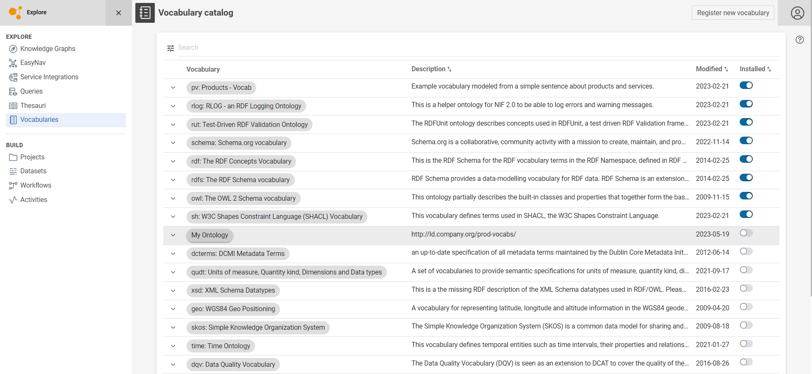

# Vocabulary Catalog

## Introduction

Vocabularies are the foundation for semantic data lifting activities.This module shows the list of all managed vocabularies in Corporate Memory that are accessible for the user. The table represents the list of known vocabularies. Installed vocabularies are indicated by the orange switch in the column `Installed`.

## Add new vocabulary

Click { .off-glb } to register a new vocabulary.

A new form will be shown, fill it an add the file to import the vocabulary to Corporate Memory.

Use the Search bar to find vocabularies based on name or other metadata.

## Extended information and options

Each table row provides a menu with more options clicking on { .off-glb } or in the `Vocabulary` column.

A vocabulary which is known and available but not installed, looks like this:

Example of extended information of uninstalled Vocabulary Catalog

-   Use **Install** or the switch in the column `Installed` to install the Catalog.
-   Use **View** to access the Vocabulary.

A vocabulary which is installed looks like this

Example of extended information of installed Vocabulary Catalog

-   Use **Uninstall** to remove an installed vocabulary or **Install** to install a vocabulary.
-   Use **View** to access the Vocabulary.
-   Use **Upload** to install or overwrite the vocabulary from a file.
