# Workspaces

The specific configuration of the application defines which options are available here, i.e. whether you can select one of several workspaces, access only a default workspace or are allowed to create own workspaces.

## Select a workspace

To select a workspace click on the **user icon** on the right side of the page

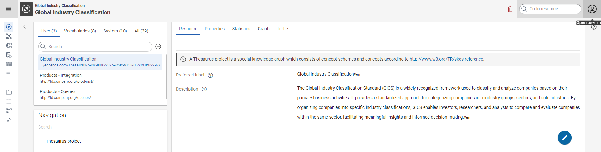{ class="bordered" }

Click the drop-down list and click the workspace you want to open.

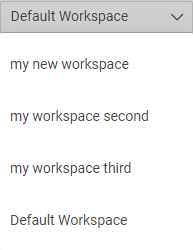{ class="bordered" }

!!! success "Step Result"

    The workspace opens and now you can enable or disabled the modules and change modeule configuration as per your requirement.

    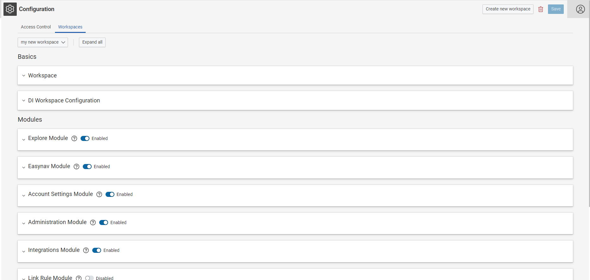{ class="bordered" }

## Configure a workspace

Click on the **user icon** on the right side of the page then click on **Configuration**.

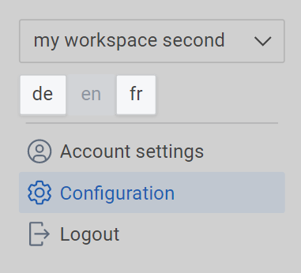{ class="bordered" }

Click on **Workspace** then select the workspace you want to see the details.

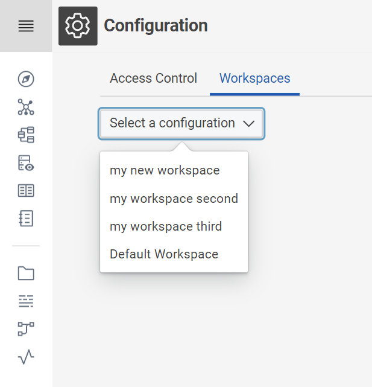{ class="bordered" }

 Click on down arrow to expand the **Workspace** and **DI Workspace Configuration** to see the configuration details as shown below.

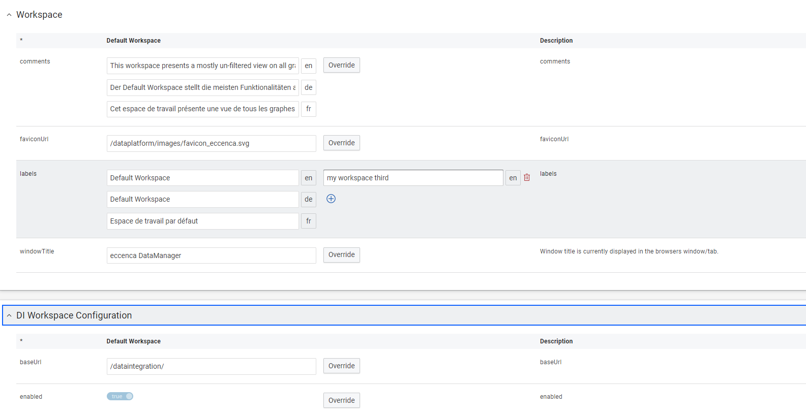{ class="bordered" }

## Add a Workspace

Click on the **user icon** on the right side of the page then click on **Configuration**.

{ class="bordered" }

Click on **Workspace** on the left side of the page then click on **Create New Workspace**

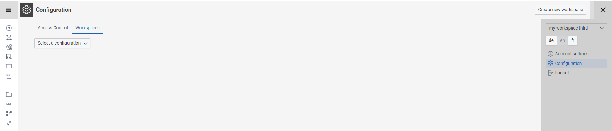{ class="bordered" }

Type the **Id** and **Label** name then click on **Add**

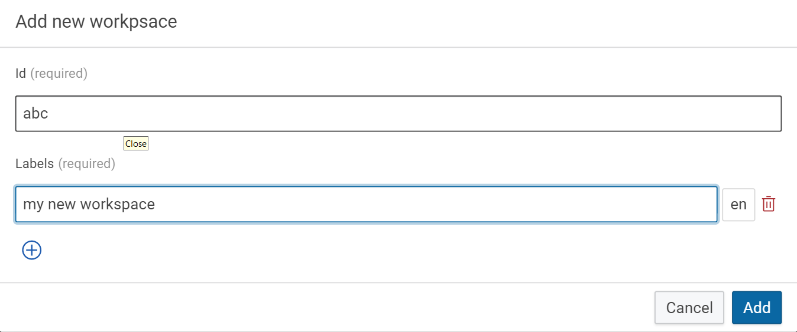{ class="bordered" }

!!! success "Step Result"

    The workspace created sucessfully and now you can enable or disabled the modules and change modeule configuration as per your requirement.

    { class="bordered" }

!!! note

    Refer to the system manual of eccenca DataManager to get more information on all the options that can be configured here.

## Delete a workspace

Click on **User Icon** on the right side of the page then click on **Configuration** then click on **Workspace**

{ class="bordered" }

Select the Workspace from the drop-down you want to delete

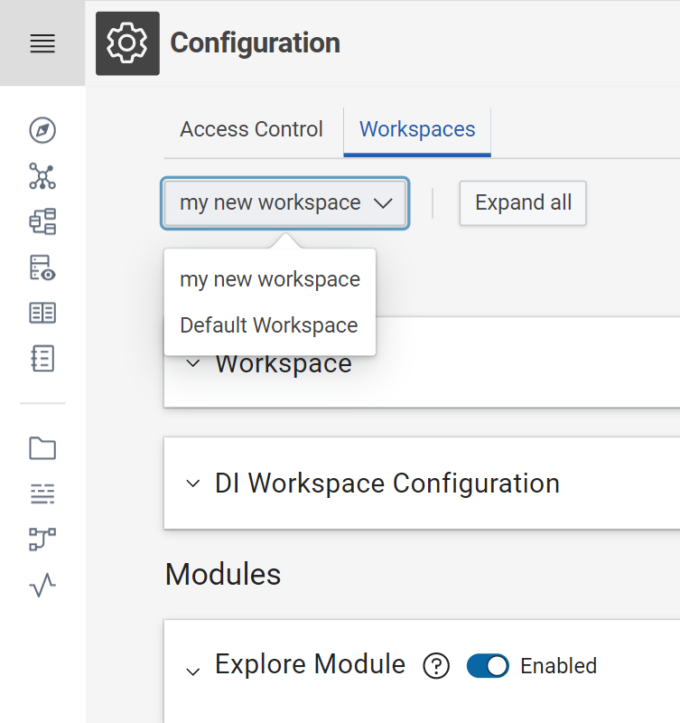{ class="bordered" }

Click on the **Delete Icon** on the right side of the page.

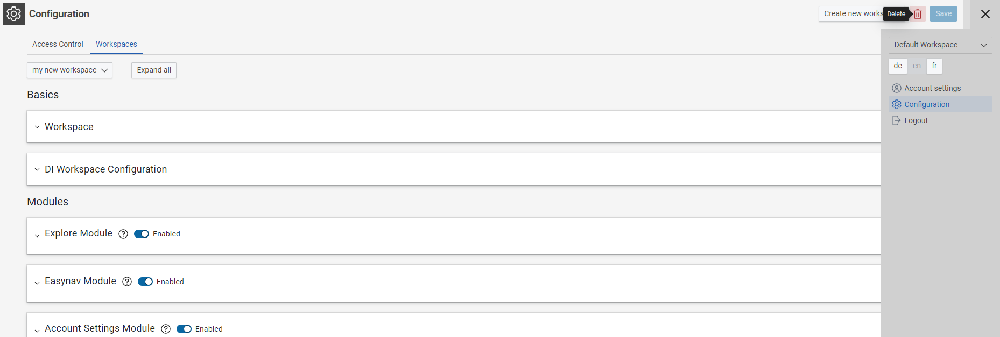{ class="bordered" }

Click on **Delete**

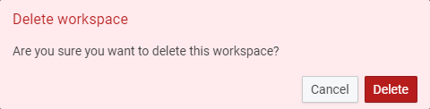{ class="bordered" }

!!! success "Step Result"

    The workspace has been deleted.

    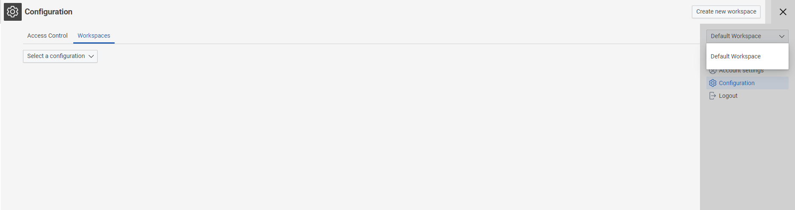{ class="bordered" }

!!! note

    When you delete a workspace, no graphs or Build projects are deleted.
