# Application view

An Application view determines which modules are available in the eccenca Corporate Memory
user interface. The Application view configuration module lets you select the
Application view you work in, configure its details, and create or delete
Application views.

## Select an Application view

To select an Application view click on the **user icon** in the top right corner.

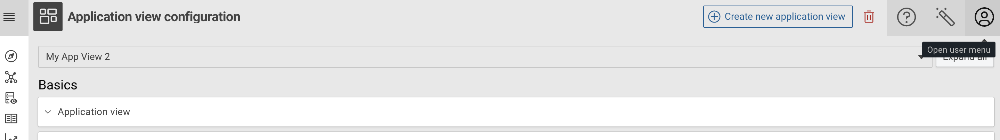{ class="bordered" }

Click the drop-down list and click the Application view you want to open.

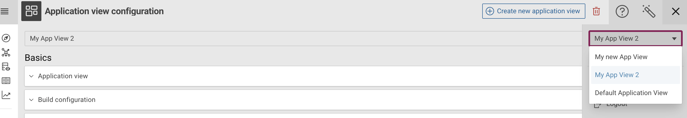{ class="bordered" }

## Configure an Application view

Click the :eccenca-module-workspace-configuration: **Application view configuration** icon in the main menu.

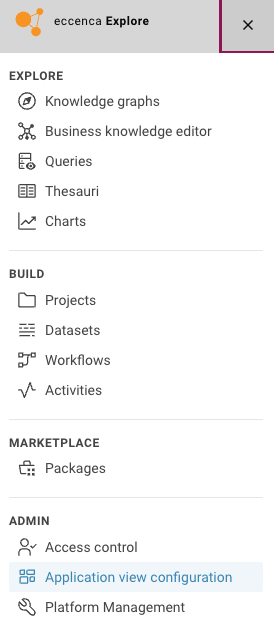{ class="bordered" }

Select the Application view from the dropdown menu to configure.

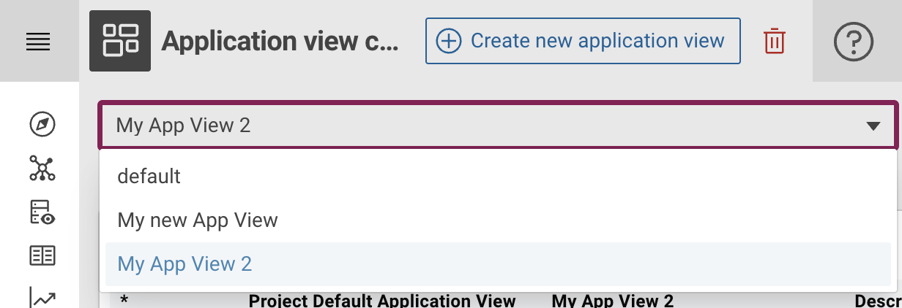{ class="bordered" width="70%" }

Click the down arrows to expand the sections to configure the details as shown below (like **Application view** or **Build configuration**).

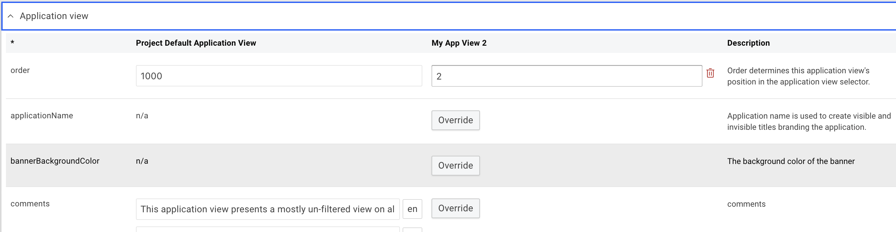{ class="bordered" }
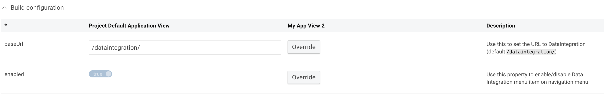{ class="bordered" }

## Add an Application view

Click on :eccenca-module-workspace-configuration: **Application view configuration** icon in the main menu then click on **Create new application view**

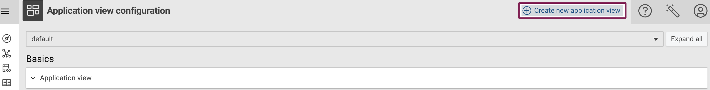{ class="bordered" }

Type the **Id** and **Label** name then click on **Add**

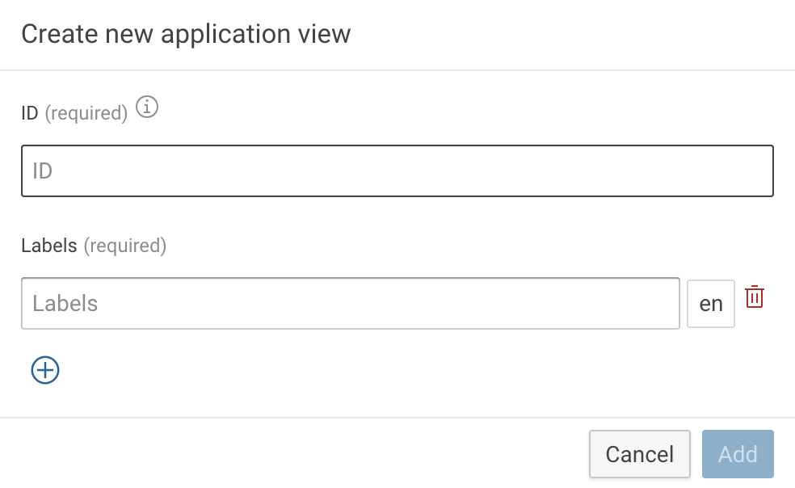{ class="bordered" width="50%" }

## Delete an Application view

Click on :eccenca-module-workspace-configuration: **Application view configuration** icon in the main menu then click on **Application view**
<!--TODO: update screenshot-->
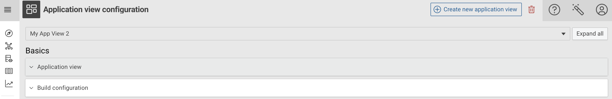{ class="bordered" }

Select the Application view from the drop-down you want to delete

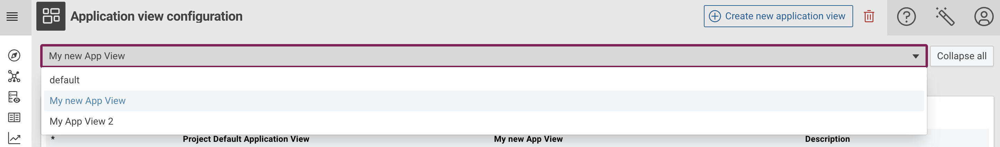{ class="bordered" }

Click on the **Delete Icon** on the right side of the page.

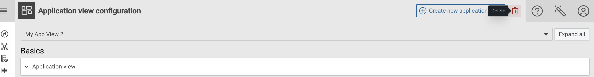{ class="bordered" }

Click on **Delete**

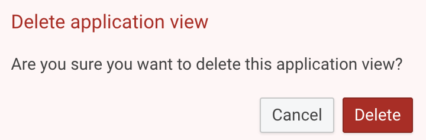{ class="bordered" width="50%" }

!!! note

    When you delete an Application view, no graphs or Build projects are deleted.
