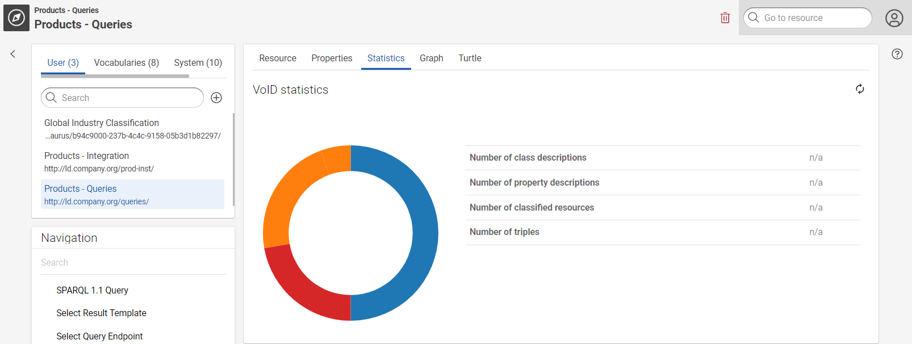
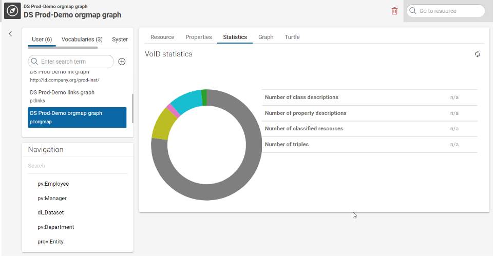

---
hide:
  - navigation
tags:
  - BeginnersTutorial
---
# Getting Started

## Introduction

This page describes how to work with Corporate Memory and shortly outlines all functionalities of the user interface.
For the installation and configuration of Corporate Memory refer to the [☆ Deploy and Configure](../deploy-and-configure/index.md) section.

!!! info

    Functions described in this manual for adding, editing or deleting data depend on the write permissions that are assigned to you.
    In case you only have read permission these functions are not available for you.

## About

eccenca Corporate Memory is a semantic data management software that accelerates analytics and reporting projects by transforming the way enterprises understand, align, prepare and access their data.

### Main features

The main features of Corporate Memory include:

-   Flexible metadata and schema layer based on knowledge graphs
-   Data virtualization and analytics
-   Data integration and indexing
-   Dataset and vocabulary management
-   Thesaurus and taxonomy management
-   Big data scalability
-   Access control

### Minimal requirements

For the best user experience, we recommend to use the newest version of Google Chrome or Mozilla Firefox. Corporate Memory is tested with the following browsers:

-   Google Chrome 83 or later
-   Mozilla Firefox 78 or later
-   Microsoft Edge 83 (on Windows) or later

## Login and Logout

To start eccenca Corporate Memory:

1. Enter the URL in your web browser.
2. Enter your credentials and click **LOG IN**.

After you logged in to your Corporate Memory instance, the main application view appears.

To log out, open the menu :material-dots-vertical: in the Module bar and click Logout.

## Workspaces

The specific configuration of the application defines which options are available here, i.e. whether you can select one of several workspaces, access only a default workspace or are allowed to create own workspaces.

See the [workspaces](../explore-and-author/workspace-configuration/index.md) section for more details.

## User interface and modules

The user interface of Corporate Memory usually consists of two sections:

1. The module bar providing access to the various modules of Corporate Memory and to a menu with further options
1. The main section for operating the software functions

Each module provides a set of functionalities and views for specific use cases.
To access a module, click the module name. The active module is highlighted.

By default, Corporate Memory provides the following modules:

-   EXPLORE - for Knowledge Graph browsing and exploration, specifically
    -   [Knowledge Graphs](../explore-and-author/index.md) - a generic and extensible RDF data browser and editor
    -   [Vocabularies](../explore-and-author/vocabulary-catalog/index.md) - for vocabulary management
    -   [Thesauri](../explore-and-author/thesauri-management/index.md) - for managing thesauri and taxonomies based on SKOS
    -   [Queries](../explore-and-author/query-module/index.md) - a SPARQL query interface
-   [BUILD](../build/index.md) - for creating and integrating Knowledge Graphs, with specific links to
    -   Projects - the BUILD Projects level
    -   Datasets - the Datasets across all BUILD Projects
    -   Workflows - the Workflows across all BUILD Projects
    -   Activities - activities overview and monitoring

!!! note

    Depending on your specific product package, more or fewer modules can be available.

Use the provided search field(s) in each module to search for specific keywords or strings in names and labels of resources.

The **Knowledge Graphs** module provides more search fields (e.g. in the Graph box, Navigation box, etc.) where you can limit your search to specific graphs or resources.

### Settings menu for table views

Each table view of Corporate Memory provides a setting menu (3) to adjust the table according to your requirements.
You can change the sorting of columns, show or hide specific columns or set filters.
To open the settings menu click :material-tune:.

### Context help

Corporate Memory provides a context help (4) for the main functions of modules.
To open the context help click :material-help-circle-outline: in the upper right corner.
To close the context help, click :material-greater-than:.

## Used Icons

This section provides an overview of icons and their functionality in Corporate Memory.

### Icons of main interaction

| Icon | Description |
| ---- | ----------- |
| :material-plus: | Add a new element. |
| :material-border-color: | Edit an element. |
| :material-trash-can: | Remove data or an element. Note that there is no 'Trash' or 'Recycle Bin'. |
| :material-help-circle-outline: | Open the context specific user help. |

### Icons for navigation

| Icon | Description |
| ---- | ----------- |
| :material-arrow-left: | Navigate back. |
| :material-chevron-left: | Navigate one page backwards. |
| :material-chevron-right: | Navigate one page forward. |
| :material-page-first: | Go to the first page. |
| :material-page-last: | Go to the last page. |

### Icons for table views

| Icon | Description |
| ---- | ----------- |
| :material-tune: | Adjust settings for a table view. |
| :octicons-filter-24: | Change filter of table columns. |
| :material-arrow-up-down: | Indicates no specific ordering. |
| :material-arrow-up: | Order this column ascending. |
| :material-arrow-down: | Order this column descending. |

### Editor specific icons

| Icon | Description |
| ---- | ----------- |
| :material-folder: | Object mappings. |
| :material-file: | Value mappings. |
