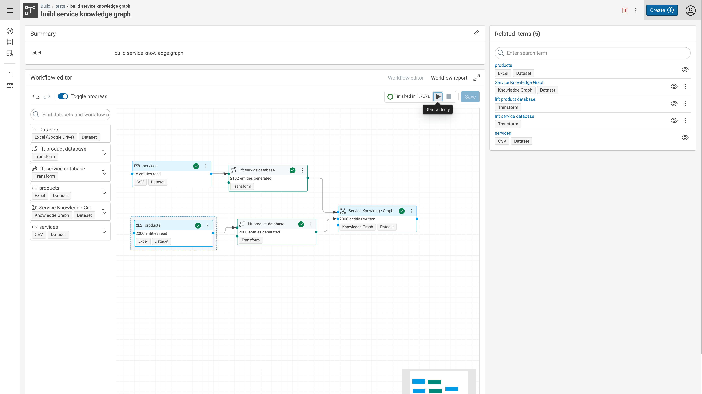

---
tags:
    - ReleaseNote
---
# Corporate Memory 21.11

Corporate Memory 21.11 is the fourth release in 2021.




The highlights of this release are:

- Build: The workflow editor user interface allows for undo/redo of you activities now, as well as shows inline (live) progress and statistics of a running workflow.
- Explore: The Explore interface is now adapted to our new look and feel + the Knowledge Graph list component can be configured to show multiple lists of named graphs e.g. to distinguish between user, vocabulary and system graphs.
- Automate: cmemc can now interact with workflow scheduler (disable, enable, inspect, list, open) as well as dataset resources (delete, inspect, usage, list).

!!! warning

    With this release of Corporate Memory the DataIntegration and DataPlatform configuration and behaviour has changed and have to be adapted according to the migration notes below.

This release delivers the following component versions:

- eccenca DataPlatform v21.11.1
- eccenca DataIntegration v21.11
- eccenca DataManager v21.11.5
- eccenca Corporate Memory Control (cmemc) v21.11.4

More detailed release notes for these versions are listed below.

## eccenca DataIntegration v21.11

This version of eccenca DataIntegration adds the following new features:

- Remote Excel Dataset using Google Drive Spreadsheets as resources.
- Remote Office 365 Spreadsheets Support.
- Workflow editor improvements:
    - View navigation via clicking and dragging the mouse on the mini-map.
    - Config input port is hidden by default and can be enabled via menu entry.
    - Inline (live) progress and statistics.
- Support mapping of RDF literals in object mappings.
    - Literals are handled as entities and can be mapped in object mappings.
    - Special path #text that allows to access the lexical value of the mapped resource. This allows to access the value of a mapped literal in an object mapping.
- RDF datasets:
    - Special path #lang that allows to access the language tag of a language tagged RDF literal.
- Extensions to the Excel dataset:
    - Excel columns may be addressed by their letter code (`#A`, `#B`, etc.) as well.
    - A new parameter 'hasHeader' allows handling of pure data sheets with no table header.
- Support selecting multiple vocabularies with auto-completion support.
- Transform URI pattern improvements:
    - Validation of URI patterns in the UI and backend, i.e. it checks that URI templates generate valid URIs.
    - Auto-completion support in URI pattern input component.
    - URI pattern validation endpoint
    - URI pattern auto-completion endpoint
    - Change initial URI pattern of complex URI rules from `/` to `{}/<OBJECT_RULE_ID>`
- REST endpoint to fetch an activity execution error report as JSON or Markdown.
- Activity integration into task detail pages:
    - Primary, running, failed and all related caching activities are shown on the task detail pages.
    - Caching activities are grouped and have additional information and controls like 'refresh all caches', last update etc.
    - For failed activities it is possible to see and download an execution error report.
- Support for requesting task parameter values in the item search API.
- New workflow operator to stop the current workflow execution (without failing) if a specified condition has been met.
    - Add global cache for URI patterns that stores all URI patterns extracted from transform tasks.
    - Add API endpoint to fetch all URI patterns used for given target class URIs.
    - Allow to select from existing URI patterns (related to the same target classes) in object mapping rule form.
- Support setting the URI pattern during creation of an object mapping rule.
- Application version info in user menu (sidebar on the right side).
- JDBC dataset does support token-based authentication for MS SQL server now.
- Undo/redo support in workflow editor.

In addition to that, these changes are shipped:

- Improved task search with highlighting for nodes in the canvas.
- Added "Default Value" Transformation to recommended category.
- OLE2-based Excel documents (e.g., .xls) are now supported in non-streaming mode.
- Enabled the Excel 'LEFT' transform function.
- Mapping Rule Editor will show the rule label (if any) and the mapping target.
- The JSON dataset supports streaming.
    - The change applies to reading JSON, writing was already streamed.
    - If streaming is enabled, files won't be loaded into memory, allowing to read large JSON files without running into OutOfMemory errors.
- Allow to open the value mapping rule formula editor from the create/edit value mapping rule form.
- Improvements to Template operators:
    - Added option to forward input attributes.
    - Allow tests in conditions (e.g., `if input1 is sequence`).
    - Updated Jinja library to latest bugfix release.
- Render markdown (links only) in meta data preview and search item description instead of markdown markup text.
- Moved `Endpoint` parameter of Knowledge Graph dataset into advanced section
- JDBC dataset will retry failed queries due to interrupted connections. Retries will start at the offset of the previously read row.
- Include query URLs in result from REST operator (multi input).
- Workflow editor: Adapt node height based on number of inputs.
- Project import does not show the error message.
- Added rail navigation bar, replacing the old navigation.

In addition to that, multiple performance and stability issues were solved.

## eccenca DataManager v21.11.5

This version of eccenca DataManager adds the following new features:

- General
    - Main navigation and application header
        - New header was enabled
        - showing the title of the current view or actually shown resource
        - includes main actions for the page
    - Main navigation was moved to the right sidebar
        - can get expanded permanently
        - offers option to get expanded in a reduced form by hovering it with the cursor
        - we now have various section in the main nav, modules with main navigation items can be configured via `subSection` parameter (order of sections need to be defined in `Navigationbar` component, currently we have `timetracker`, `explore`, `build` and `other` as options, if not set it is automatically organized into `explore` or `other`)
        - **Deprecation notice:** configuration variables `windowTitle` and `headerName` are now deprecated, please use `companyName`, `productName` and `applicationName` from `appPresentation`
- Query Module
    - New Query Module v2
    - Activated per default
    - Improved catalog functionality
    - Richer editor based on yasqe
    - Integrated prefix handling
- Vocabs Module
    - Allow create new empty ontology without uploading a file.
    - Check if graph exist and show an error while creating a new vocab.
- Explore
    - Allow hide / show the vocab viz module via configuration `details.visualization.enable`
    - Center automatically load vocab viz on load
    - Show precise tooltips for controls of vocab viz
    - `NavigationListQuery` now accepts `{{GRAPH}}` as placeholder
    - Selectbox load values on focus rather than on click to allow using keyboard.

In addition to that, these changes are shipped:

- Explore
    - bug producing runtime errors in vocab viz
    - Extended existing `externalTools` mechanism for custom iframes
- Build
    - simplify configuration object DIWorkspace removing unused `url` value, letting only `enable: BOOLEAN` and `baseUrl: URL_TO_DATAINTEGRATION`
- Shacl
    - Reload form if language changes
    - Load form data using the current selected language
    - Show group header if there are visible elements with no value in shacline
    - Display selected value in options in select boxes when it is no multi select
    - Don't send empty datatypes to saveShaped as are interpreted as `<file:///data/>`.
- Query Module
    - Improve search on query module
    - Order prefixes alphabetically
    - URL parameters: use `query` to open a query by IRI or `queryString` to open a query by query string
- General
    - Reorder modules. Move Explore to position 1, query to position 4 and manage to the last
- Explore
    - Group values if only origin graph differs in shacl view.
    - replace `markdown-it` with `react-markdown` library and refactor usage
    - update navigation queries `navigation.topQuery` and `navigation.subQuery`
- Vocab
    - Use relative paths properly when requesting DI login prefixes or cache endpoints.
- Thesaurus
    - Fix links in detail view to point to the selected concept
    - Fix button "See more in list" to point to explore instance view
    - Prevent infinite loop displaying tabs in detail view

In addition to that, multiple performance and stability issues were solved.

## eccenca DataPlatform v21.11.2

This version of eccenca DataPlatform ships the following new features:

- Prometheus and Spring metrics endpoints are now exposed per default, i.e. `./actuator/prometheus` or `actuator/metrics` for list and, exemplarily, `./actuator/metrics/cache.size` for the metric of interest, see the [spring doc](https://docs.spring.io/spring-boot/docs/current/reference/html/actuator.html#actuator.metrics.endpoint) for more information.
    - you can deactivate them using the configuration properties in `application.yml` (or any other spring config)

``` yaml title="application.yml"
endpoint:
    prometheus:
        enabled: false
    metrics:
        enabled: false
```

    - Users roles need to match values of `authorization.abox.adminGroup` or `authorization.abox.metricsGroup` role definition for accessing those endpoints. `authorization.abox.metricsGroup` defaults to `metrics`, therefore in keycloak a user needs to `metrics` added as role, for example via a group and groupmapping.

- graphdb lucene index support
    - the index is used for example in the explore section to allow fast and userfriendly access
- Graph List
    - The graph list query is now configurable, using the parameter `proxy.graphListQuery` with a default value of `SELECT distinct ?g {graph ?g {?s ?p ?o}}`

In addition to that, these changes and fixes are shipped:

- Middleware Upgrades
    - Upgraded Stardog support to version 7.8.3.
    - Upgraded GraphDB support to version 9.10.2
- Change of proxied graph store get endpoint `/proxy/{id}/graph`
    - Removal of support for timeout and ETags
    - Usage of underlying store graph store endpoints (if available) for performance
- Upgraded Stardog support to version 7.8.3.
- Upgraded GraphDB support to version 9.10.2
- stop words in search expression are no longer removed

## eccenca DataPlatform v21.11.1

This version of eccenca DataPlatform ships the following new features:

- Prefixes are now used in TURTLE serializations
    - Prefixes defined in the Vocaulary catalog are used.
- Added support for all shacl:path expressions
    - `shui:inversePath` is still supported, however please use [`sh:inversePath`](https://www.w3.org/TR/shacl/#property-path-inverse) wherever possible.
- Property usage analytics endpoints `api/vocabusage/*` for both explicit Vocab definitions and usage information. Please refer to the OpenAPI definitions for more information.
- Explicitly defined supported-submit-methods property to enable / disable "Try I Out" button in Swagger UI.
- Server side UI configuration Support
    - Shapes for `WorkspaceConfiguration` added
    - Configuration endpoint `api/conf/workspace` exposes workspace specific information about graph lists.
    - `graphs/list` endpoint includes graph list association for customization of the navigation list.
- Shape-intgrated Workflow triggering
    - Shapes extended for linking a Shape to DI workdlows
    - extension of the `/api/resource/shaped` endpoint to include this information
- Bootstrap Data:
    - example configuration the default workspace's navlist
- Admins can now manually flush all caches per api call.

In addition to that, these changes and fixes are shipped:

- Apache Jena 3.17 is now used.
    - SPARQL requests to virtuoso are now executed over HTTP (see migration notes)
- Graph exports now sorted by subject resource
- IT tests:
    - Updated IT test GraphDB Docker image to v9.9.0-1-se
    - parametrization
    - DefaultGraphIT
    - Resources refactoring
- Bootstrap Data:
    - upgrade some vocabulary references to new versions (fibo, org, qudt, schema, gist, time)
    - Updates Spring Security to mitigate potential security issue: CVE-2021-22119
    - Improved API documentation for APIs offering multiple HTTP methods (i.e. `GET` and `POST`). Improves OpenAPI client generation
- GSP Endpoint:
    - read content type from multipart files and use only file extension only as backup
- Jinja templates:
    - templates no fail on unknown tokens, allowing easier useage of SPARQL `OPTIONAL` values in templates.
- Removed:
    - Virtuoso Provisioned Authorization is no longer supported. Use `FROM` authorization instead.
- Errors in the configuration graph gracefully fall back to the default config
- GraphDB FROM Authorization is correctly initialized for the SPARQL proxy
- Type fetching on stardog could lead to NullPointerException
- Facets on graphs without imports on Stardog
- Graph type query was optimized to only fetch types of interest
- Errors in the configuration graph gracefully fall back to the default config
- GraphDB FROM Authorization is correctly initialized for the SPARQL proxy
- Type fetching on stardog could lead to NullPointerException
- Facets on graphs without imports on Stardog
- Graph type query was optimized to only fetch types of interest

## eccenca Corporate Memory Control (cmemc) v21.11.4

This version of cmemc adds the following new features:

- `dataset resource` command group with the following resource commands:
    - `delete` - Delete file resources.
    - `inspect` -Display all meta data of a file resource.
    - `list` - List available file resources.
    - `usage` - Display all usage data of a file resource.
- scheduler command group with the following workflow scheduler commands:
    - `disable` - Disable a scheduler.
    - `enable` - Enable a scheduler.
    - `inspect` - Display meta data of a scheduler.
    - `list` - List available schedulers.
    - `open` - Open scheduler in the browser.
- `config eval` command
    - shell environment preparation for configuration

In addition to that, these changes are shipped:

- docker base image is now `debian:stable-20211011-slim`
- workflow execute commands now uses `ExecuteDefaultWorkflow` as activity (instead of `ExecuteLocalWorkflow`)
- `admin token --decode` table now sorted by Key column
- `dataset inspect` table now sorted by Key column
- `query status` table now sorted by Key column
- `vocabulary cache list` table now sorted by IRI column
- `dataset create --type` completes now plugin IDs as well

## Migration Notes

### DataIntegration

- The fix of 'XML dataset ignores base path when type URI is set.', could break existing projects that are relying on the previously broken behaviour.
    - This may affect all use cases with XML datasets that have the 'base path' parameter set to a non-empty value AND where a transformation or linking task overwrites this path by setting a type path/URI.
    - Removing the 'base path' value from the affected XML datasets should solve the issue.
- Generating URIs for entities failed if XML tags contained dots
- The JSON dataset uses streaming by default now, which does not support backward paths.
- Using backward paths will fail and the error message will contain a suggestion to change the streaming parameter to false.

### DataManager

No migration notes

### DataPlatform

- Jinja templates will no longer fail on unknown tokens. If this was used for signaling errors or fail-fast evaluation, this has to be implemented in regular conditional checks.
- Virtuoso config requires adjustments, its HTTP port needs to be configured.
    - Please ensure, that the configured user has the same access rights in virtuoso via ODBC and HTTP

``` yaml title="application.yml (old)"
sparqlEndpoints:
  virtuoso:
  - id: "default"
    authorization: NONE
    host: "store"
    port: "1111"
    username: "dba"
    password: "dba"
```

    becomes

``` yaml title="application.yml (new)"
sparqlEndpoints:
  virtuoso:
  - id: "default"
      authorization: NONE
      host: "store"
      port: "1111"
      httpPort: "80"
      username: "dba"
      password: "dba"
```

### cmemc

No migration notes.
