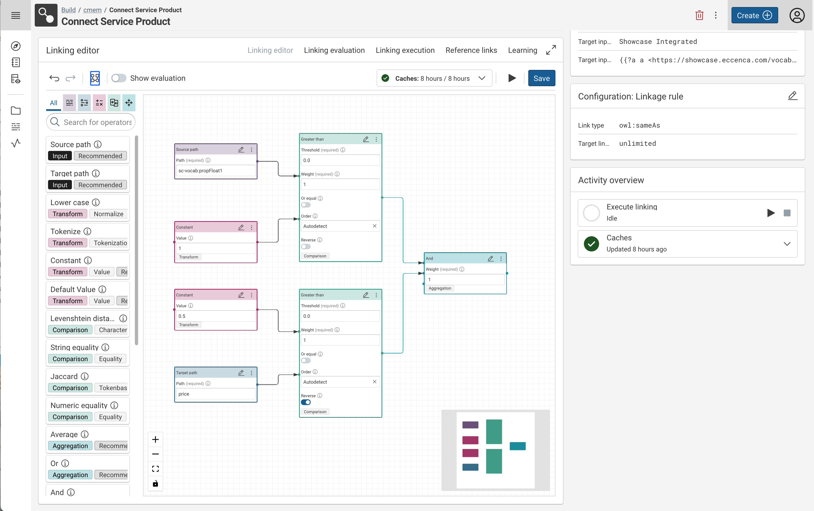

# Corporate Memory 22.1

Corporate Memory 22.1 is the first release in 2022.

The highlights of this release are:

- Build:
    - The all new linking editor offering a new level of user experience in the linking process supercharged with inline preview and inline validation, improved operator search and much more
    - Python plugin SDK (workflow and transformation plugins)
- Explore:
    - Shacl: Customizable workflow execute button in Property Shapes allows for declarative embedding of
    - Backend: Support for Amazon Neptune as primary Knowledge Graph Store incl. bulk loading of large files via Amazon S3
- Automate:
    - new commands and command groups making the Corporate Memory swiss-command-line-army-knife - cmemc - even more useful
    - Python plugin command group adds capabilities for managing python plugins in your build workspace (admin workspace python)
    - Store command group adds managing commands on quad store level (admin store)
    - Metrics command groups allows for inspecting of server metrics (admin metrics, DataPlatform metrics only at the moment)

!!! warning

    With this release of Corporate Memory the DataPlatform configuration and behavior has changed and have to be adapted according to the migration notes below.

This release delivers the following component versions:

* eccenca DataPlatform v22.1
* eccenca DataIntegration v22.1
* eccenca DataManager v22.1.1
* eccenca Corporate Memory Control (cmemc) v22.1.1

More detailed release notes for these versions are listed below.

## eccenca DataIntegration v22.1

This version of eccenca DataIntegration adds the following new features:

- Artifact creation dialogs now allows to set the parent project
- Added a parameter to JDBC datasets to allow clearing the table before workflow execution.
- Support for custom project and task identifiers at item creation time.
- Menu option to copy item ID to clipboard.
- Value type to represent geometry as WKT literals.
- Python plugin support
    - Initial support for workflow and transform plugins.
    - Plugins are executed in a Python 3 environment.
    - Check documentation for details: [Python Plugins](../../develop/python-plugins/)
- User-defined tags on projects and tasks.
- REST endpoint to fetch rule operator plugins (`/api/core/ruleOperatorPlugins`).
- `convertToComplex` query parameter to GET transform rule REST endpoint to always request a complex value transform rule.
- Add new route to display a task view plugin all by itself without headers, side bar etc.
    - Route: `/workbench/projects/:projectId/item/:pluginId/:taskId/view/:viewId`
- REST endpoint to evaluate a linking rule against the reference links only.
- New linking and transform editors:
    - User created layout and auto-layouting support.
    - Multi-word rule operator search with highlighting.
    - New node actions: select nodes, move selection
    - New edge actions: Connect edge to first free input port via dragging over node, Swap edges
    - Delete selected node(s) or edge via ++backspace++
    - Select nodes via select box (press ++shift++ + left mouse button & draw rectangle) or multi select (press ++alt++ or ++cmd++ + left clicks): Delete, move clone selection
    - Filter out 'Excel' category of operators when `hideGreyListedParameters` query parameter is set to true.
    - Supports read-only mode. Query parameter `readOnly` sets the editor in permanent read-only mode.
    - Allow to edit rule node parameters in a larger modal, so complex parameter values can be more easily edited.
        - All changes done in that modal can be updated in a single transaction (wrt. UNDO/REDO) or cancelled.
    - Inline evaluation
        - Show operator output values and evaluation scores directly inside the linking rule editor nodes
        - Support to show link to external reference links UI via `referenceLinksUrl` query parameter.
        - Support for real-time evaluation when reference links are available
- Simple path operator auto-completion

In addition to that, these changes are shipped:

- Support writing large XML files by using a memory-mapped key-value store internally.
- Request N-Triples instead of Turtle for SPARQL Construct queries in all RDF datasets, because some RDF stores run into memory problems when requesting Turtle.
- Improved performance of listing project resources on S3.
- The maximum size of the internal key value store can be configured now.
    - Default value is: `caches.persistence.maxSize=10GB`
- Improved writing to PostgresQL by using CSV import.
- If an operator writes multiple tables into a dataset that cannot hold multiple tables, an error is thrown now.
    - Example: A hierarchical transformation writes into a CSV file.
    - Previously, the last table has been written.
- Workflows can also be executed asynchronously using the "simple" workflow execution endpoints.
- If a sub-workflow is running, the workflow editor will display the full sub-workflow report.
- Keep sort config and page size when switching filters in faceted search views.
- In generated transform object rules for nested data sources (XML, JSON and RDF) keep the source path even for paths pointing at literal values, e.g. strings.
- Use DataPlatform's `facets` and `vocabusage` endpoints to fetch available properties for Knowledge Graph datasets in order to improve performance and load.
- Generated project & task identifiers: Put label-part as prefix and shorten and simplify generated random string.
- Show labels and links for dependent tasks in delete modal.
- Added parameter to "lower than" and "greater than" metrics to choose order.

In addition to that, multiple performance and stability issues were solved.

## eccenca DataManager v22.1.1

This version of eccenca DataManager adds the following new features:

- Shacl: Customizable workflow execute button in Property Shapes.
- Explore: New Graph List component with configurable lists.

In addition to that, these changes are shipped:

- General
    - Updated `typescript` to `^4.5.2` and `@reduxjs/toolkit` to `^1.6.2`.
    - Use session cookie to authenticate in DI requests.
    - Removed Save graph void stats from the Statistics tab.
- Shacl
    - Allow HTML in Markdown of Shacl descriptions and ObjectView

In addition to that, multiple performance and stability issues were solved.

## eccenca DataPlatform v22.1

This version of eccenca DataPlatform ships the following new features:

- Admin endpoints for zip backup / restore of all graphs
- New endpoints for storage, analysis and upload of files (rdf files and zip/tgz)
    - `/api/upload/` for storing and analyzing stored files
    - `/api/upload/transfer` for transferring stored files to rdf triple store
    - stored files on system are removed in housekeeping maintenance job
- Integrated Neptune as a triple store including bulk loading of large files via Amazon Simple Storage Service (Amazon S3)

In addition to that, these changes and fixes are shipped:

- Changed proxied graph store to get endpoint `/proxy/{id}/graph`
    - Removed support for timeout and ETags.
    - Used underlying store graph store endpoints (if available) for performance.
- Middleware Upgrades
    - Upgraded Stardog support to version 7.9.0
    - Upgraded GraphDB support to version 9.10.2
- Library Upgrades
    - Upgrade to Java 11
    - Upgrades of several libraries including Spring Boot 2.6.6 has been done.
    - Upgrade of Apache Jena 4.4 implies usage of JDK11 http client library instead of apache http client.
- Query Monitor
    - New fields added to output of `/api/admin/currentQueries` endpoint: `user` (Executing user in form of IRI), `type` (Query type - one of `ASK`, `SELECT`, `CONSTRUCT`, `DESCRIBE`, `UNKNOWN`), `traceId` (Trace id of call to Dataplatform - this id bundles 1-n child ids for each query call to backend store)
    - Introduced Spring Sleuth tracing for generation of query IDs and tracing IDs of requests

In addition to that, multiple performance and stability issues were solved.

## eccenca Corporate Memory Control (cmemc) v22.1.1

This version of cmemc adds the following new features:

- `admin workspace python` command group
    - `install` - Install a python package to the workspace
    - `list` - List installed python packages
    - `list-plugins` - List installed workspace plugins
    - `uninstall` - Uninstall a python package from the workspace
- `project import` command
    - output warnings in case there are failed tasks errors
- `graph export` command
    - the `--filename-template` / `-t` option has now a completion of common examples
- `query replay` command
    - replay query logs from the query status command
- `admin status` command
    - Output of DataManager version and status
    - Output of ShapesCatalog version and status
- `query status` command
    - Type filter allows for filtering by query type
    - status filter accepts value `error` to filter for non-successful queries
- `admin store` command group
    - `export` - backup all knowledge graphs to a ZIP archive
    - `import` - restore graphs from a ZIP archive
    - `bootstrap` - was `admin bootstap`
    - `showcase` - was `admin showcase`
- `admin metrics` command group
    - `get` - Get sample data of a metric
    - `inspect` - Inspect a metric
    - `list` - List metrics for a specific job

In addition to that, these changes and fixes are shipped:

- docker base image is now `python:3.9-slim`
- graph tree `--id-only` option
    - this option now outputs a flat, de-duplicated list of existing graphs
    - the old output was similar to the default tree output and not useful for piping
- tested and build python version is now 3.9
- cmempy tests for python 2.7 are now disabled
- `graph list` command
- SPARQL 1.1 Service Description namespace now recognised as `sd:` (e.g. in virtuoso used)
- `query list` command
    - newly introduced query types are treated correctly now
    - additional types: `DELETE`, `DROP` and `INSERT`
- docker image has now an empty `config.ini` in order to avoid warnings when using cmemc with environment variables only

The following commands are deprecated:

- `admin bootstap` command
    - is now in admin store command group, will be removed with the next release
- `admin showcase` command
    is now in admin store command group, will be removed with the next release

In addition to that, multiple performance and stability issues were solved.

## Migration Notes

### DataIntegration

- Writing hierarchical transformations into a CSV dataset or any other datasets that are single tables will lead to an error.
- The following plugin IDs have been renamed. Old projects can still be loaded with this DI version, but reading projects written with this version using DI releases older than 22.1 can result in project loading errors:
    - Substring comparison: ID `substring` to `substringDistance`
    - Constant distance measure: ID `constant` to `constantDistance`
    - Negate transformer: ID `negate` to `negateTransformer`
- DI uses new DataPlatform endpoints for schema extraction from knowledge graphs by default, i.e. some functionality will break when run with an older DataPlatform.
    - Set `eccencaDataPlatform.sparqlSource.retrievePathsViaDpEndpoints` to false in order to use the old approach.

### DataManager

- New Graph List component with configurable lists.
    - The lists can be configured in the cmem config graph.
    - Configurations in the `<datamanager>/application.yml` are ignored any customizations need to be migrated.

### DataPlatform

- While updating, property `spring.profiles=PROFILE` needs to be replaced by `spring.config.activate.on-profile`. For further information, please see [this blog post](https://spring.io/blog/2020/08/14/config-file-processing-in-spring-boot-2-4).
- Removed custom redirect for Swagger UI under `/swagger-ui`. Swagger UI only accessible under `/swagger-ui.html` (Spring Boot Default)

### cmemc

- docker image usage
    - the cmemc docker image is now built to run as user `cmem` (id: `999`)
    - the container internally used config file has changed
        - old: `/root/.config/cmemc/config.ini`
        - new: `/config/cmemc.ini`
        - This means, mounted config volumes need to be changed!
- deprecated commands
    - `admin bootstrap`|`showcase` are deprecated
    - use `admin store bootstrap`|`showcase` instead

