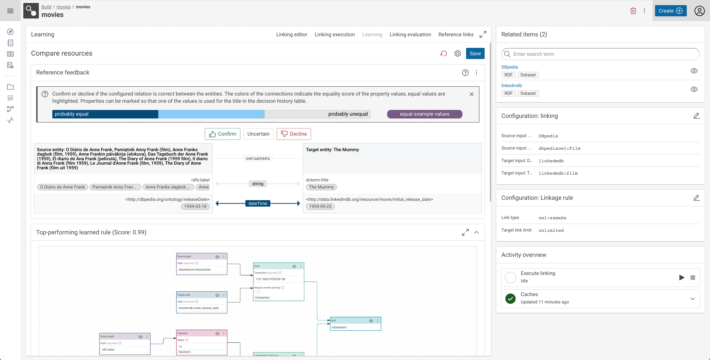
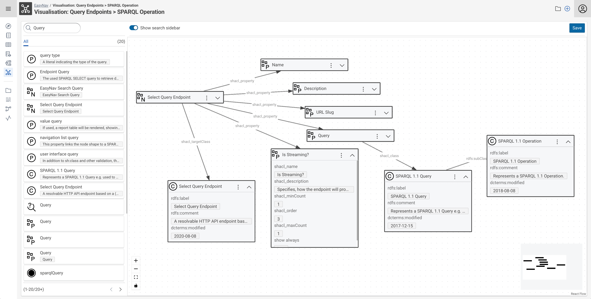
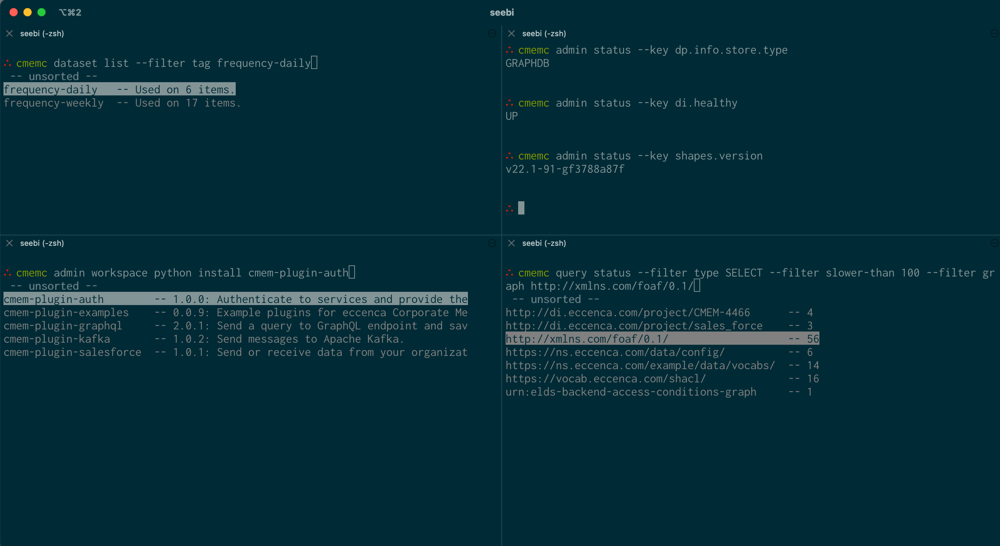

# Corporate Memory 22.2.3

Corporate Memory 22.2.3 is the third patch release in the 22.2 release line.

The highlights of this release are:

-   Build:
    -   The all new **Active** (Link) **Learning UI**
    -   Extended **Python Plugin SDK**
-   Explore:
    -   New graph exploration module **EasyNav**
-   Automate:
    -   Tag filter, better status monitoring and complete query management

!!! warning

    With this release of Corporate Memory the DataPlatform configuration and behavior has changed and needs to be adapted according to the migration notes below.

!!! warning

    With this release of Corporate Memory the (DataIntegration) Python plugin SDK contains the `ExecutionContext` class. This results in a changed signature of the SDK API functions and causes a breaking change to your exisitng code. Your python SDK based plugins need to be adapted according to the migration notes below.

This release delivers the following component versions:

-   eccenca DataPlatform v22.2.2
-   eccenca DataIntegration v22.2.1
-   eccenca DataManager v22.2.3
-   eccenca Corporate Memory Control (cmemc) v22.2

More detailed release notes for these versions are listed below.

## eccenca DataIntegration v22.2.1

v22.2.1 of eccenca DataIntegration adds the following new features:

-   Rule and workflow editors:
    -   Support automatic scrolling when moving beyond the editor canvas borders on a all drag and edge connect/update operations.
-   Added "sort words" transform operator, which sorts words in each value.

In addition to that, these changes are included in v22.2.1 of eccenca DataIntegration:

-   Rule editors (linking, transform):
    -   On tab change do not remove the search text, instead select the text to easily overwrite it.
    -   Allow to search for input paths in the `All` tab.
-   If a long-running workflow is executed manually, the same workflow can be started by a scheduler in the background.
-   Executing workflows did not occupy a slot in the thread pool (i.e., unlimited workflows could be executed concurrently).
-   Generating links could lead to a deadlock, if no slot in the thread pool is available.
-   Entering an invalid URI as path input in the linking editor with a knowledge graph as input results in the rule being broken in the editor.
-   Linking editor: Show the same property labels in the input path auto-completion as in the tab auto-completion.

v22.2 of eccenca DataIntegration adds the following new features:

-   New active learning UI
-   Python plugins: Added context objects that allow accessing context dependent functionalities, such as:
    -   The current OAuth token
    -   Updating the execution report (for workflows)
    -   DI version
    -   Current project and task identifiers
    -   Requires `cmem-plugin-base >=2.0.0`
-   Workflows search link in main navigation
-   Linking rule editor
    -   Advanced parameter toggle that shows/hides advanced parameters like `weight` and advanced section in rule parameter modal
-   Support for sticky notes in both linking and workflow editors
-   Parameter `profiling.defaults.noEntities` to configure the default entity limit for profiling operations
-   Parameter `org.silkframework.runtime.activity.concurrentExecutions` to set the max. concurrent activity instances
-   Support for the `URI attribute` parameter of datasets
-   Support for auto-configuration in create/update dialog
-   Config parameters:
    -   `profiling.defaults.noEntities` to configure the default entity limit for profiling operations
    -   `org.silkframework.runtime.activity.concurrentExecutions` to set the max. concurrent activity instances
    -   `cors.enabled`, `cors.config.allowOrigins` and `cors.config.allowCredentials` to configure CORS settings

In addition to that, these changes are included in v22.2:

-   Move `outputTemplate` parameter to advanced section of XML dataset plugin
-   Improved performance of conversions to floating point numbers
-   Improved linking performance
-   Show report on linking execution tab
-   When the evaluation fails because of missing paths in the cache give specific error message with node highlighting instead of generic error notification
-   Errors in invalid Python packages are recorded and returned, instead of failing
-   Size of the activity thread pool can be configured
-   Linking rule editor
    -   Show linking rule label above toolbar when in integrated mode
    -   Handle "reversible" comparators, e.g. "Greater than", by allowing to switch source/target inputs instead of setting the 'reverse' parameter
-   DataPlatform API timeout is configurable now
-   Workflow progress information was moved to node footer that is displayed empty when no information is available
-   Docker image base: `debian:bullseye-20220912-slim`
-   Return 503 error before exceeding the concurrent activity execution limit instead of discarding a running activity instance
-   Do not execute empty object mapping rules to improve performance
-   Remove root (start) page:
    -   Redirect to workbench project search page
    -   Remove legacy workspace link from user menu
    -   Add "load example project" action to user menu
-   Show activity labels instead of IDs in task activity overview

In addition to that, multiple performance and stability issues are addressed.

## eccenca DataManager v22.2.3

v22.2.3 of eccenca DataManager has the following fixes:

-   LinkRules
    - Rule Setup: Fix display of filter

v22.2.2 of eccenca DataManager has the following fixes:

-   General
    - Logout in DM also triggers logout in DI
-   LinkRules
    - Rule Setup: Rule filter correctly displays OneOf and NoneOf
    - Rule is correctly serialized after editing, preventing the rule contents to be deleted

v22.2.1 of eccenca DataManager has the following fixes:

-   LinkRules
    -   Fixed trigger of refetching data after an update
    -   Display of negative Reference Links

v22.2 of eccenca DataManager adds the following new features:

-   Navigation
    -   Add DataIntegration workflows link to main navigation
-   Vocabulary Catalog
    -   Inline vocabulary metadata via (editable) shape
    -   Ability to activate git synchronization of changes
        -   Change history with diff view and ability to revert to a specific commit
-   Explore
    -   New (Shacl) Template based graph creation wizard
        -   Supporting different methods to define / select graph IRIs
        -   Support for bulk add via `.zip` archives containing multiple RDF files
-   i18n
    -   French translation
-   EasyNav
    -   New graph visualization module
    -   With search filter configuration
    -   Bulk node search and bulk add
    -   Ability to save, load and share explorations

In addition to that, these changes are included in v22.2 of eccenca DataManager:

-   Increase height of Turtle editor in the resource details view.

In addition to that, multiple performance and stability issues are addressed.

## eccenca DataPlatform v22.2.2

v22.2.2 of eccenca DataPlatform has the following changes:

-   Fixed
    - reintroduced support for IRI templates in node shapes, with only the uuid placeholder.
    - Prevent buffer overflow for large query results streaming to client
-   Changed
    - Maintenance: Updated Spring Boot to 2.7.8

v22.2.1 of eccenca DataPlatform has the following fixes:

-   Update of dependencies because of vulnerabilities i.e. Spring Boot.
-   Addition of logstash runtime dependency as to enable json logging.
-   GraphDb indices are created without facet option causing problems.
-   Fix of memory leak in query monitor causing high heap usage.
-   Refactoring of spring integration tests (IT) and inclusion of most tests in the cucumber subproject.

v22.2 of eccenca DataPlatform ships the following new features:

-   Added support for manual query/update cancellation:
    -   active for graphdb, stardog, neptune
    -   DELETE `/api/admin/currentQueries/{queryId}`
    -   Neptune updates cannot be cancelled because queryId header not processed
-   Added support for creation of configured graphdb repository on DP startup
    -   `store.graphdb.createRepositoryOnStartup`: Flag if repository shall be created on startup (default: false)
-   Added support for selective invalidation of caches (graph list, shapes) via Update parsing / GraphDb Change Tracking
    -   `proxy.cache-selective-invalidation`: true if activated, false otherwise full flush on every write (default: true)
    -   `store.graphdb.graphDbChangeTrackingActive`: Whether change tracking for updates is active - better results for cache invalidation (default: true)
    -   `store.graphdb.graphDbChangeTrackingMaxQuadMemory`: Amount of quads as a result of an update which are loaded into memory for analyzing consequences for caches (default: 1000)
-   Automatic creation of default `application.yml` and gradle tasks for generation of markdown documentation
-   Added endpoints for supporting easynav graph visualizations
    -   search and resource listing via `/api/search`
    -   managing of persisted visualisations via `/api/navigate` endpoints
-   Added provisioning of jinja templates with provided substitution map for endpoint `/api/custom/{slug}`
-   Added property `proxy.descriptionProperties` (analogous to `proxy.labelProperties`) for defining search relevant description properties
-   Extend query monitor
    -   Added fields per entry
        -   `timeout`: value in ms of the query/update timeout
        -   `timedOut`: boolean value on whether the query timed out or not
        -   `cancelled`: boolean value on whether the query has been cancelled manually
        -   `running`: boolean value on whether the query is currently still being executed
        -   `affectedGraphs`: on successfully finished query/update the affected graphs are shown (if possible to determine)
    -   Added property for memory bound consumption in MB for query monitor list
        -   `proxy.queryMonitorMaxMemoryInMb` (Default: 30)
    -   Added fields to prometheus metrics endpoint
        -   `querymonitor_memoryusage_total`: memory usage of query queue in MB
        -   `querymonitor_queuesize_total`: query queue size
-   Extend actuator info endpoint with store backend properties, `/actuator/info`:
    -   fields under store:
        -   `type`: same as `store.type` property (MEMORY, HTTP, GRAPHDB, STARDOG, VIRTUOSO, NEPTUNE)
        -   `version`: if possible / otherwise UNKNOWN
        -   `host`: if applicable otherwise N/A
        -   `repository`: if applicable otherwise N/A
        -   `user`: if applicable otherwise N/A
-   Add non-transactional git sync of graph changes
    -   graphs can be configured via graph configuration for bi-directional git sync
    -   cf. config properties under `gitSync.*`

In addition to that, these changes and fixes are included in v22.2 of eccence DataPlatform:

-   New store configuration properties, see below for migration notes
-   Changed property for defining select query for graphList
    -   setting is store dependant and not valid for some stores
    -   property `proxy.graphListQuery` (`proxy.graph_list_query`) moved to store settings:
        -   `store.stardog.graphListQuery`
        -   `store.neptune.graphListQuery`
-   Changed property for scheduled cache invalidation
    -   `proxy.cacheInvalidationCron`: Spring boot cron entry cf. (default: `* */30 * * * *`)
    -   [https://docs.spring.io/spring-framework/docs/current/reference/html/integration.html#scheduling-cron-expression](https://docs.spring.io/spring-framework/docs/current/reference/html/integration.html#scheduling-cron-expression)
-   Library updates including Spring Boot / Stardog
-   Changed property for DP query system timeout
    -   `proxy.queryTimeoutGeneral` -> `store.queryTimeoutGeneral` in ISO 8601 duration format (default: `PT1H`)
-   Changed loading of model entities i.e. shapes cache
    -   load model entities using GSP requests instead of construct queries
    -   Changed property for base IRI: `files.defaultBaseIri` to `proxy.defaultBaseIri` (default: `http://localhost/`)

The following functionalities have been discontinued:

-   Support for provisioned store authorization
-   Command line options create-config, update-war
-   WAR build target and support for WAR servlet deployment
-   Property for DP query system timeout check interval
    -   `proxy.queryTimeoutCheckCron` not necessary anymore
-   Support for multiple endpoints

In addition to that, multiple performance and stability issues are addressed.

## eccenca Corporate Memory Control (cmemc) v22.2

This version of cmemc adds the following new features:

-   `project reload` command
    -   Reload all tasks of a project from the workspace provider
-   `admin workspace python list-plugins` command
    -   New option `--package-id-only` to output only package IDs
-   `admin workspace python install` command completion
    -   now also provides plugin packages published on pypi.org
-   `query status` command
    -   New filter `query`:
        -   `graph` - List only queries which affected a certain graph (URL)
        -   `regex` - List only queries which query text matches a regular expression
        -   `trace-id` - List only queries which have the specified trace ID
        -   `user` - List only queries executed by the specified account (URL)
    -   New values for filter `status`:
        -   `cancelled`: List only queries which were cancelled
        -   `timeout`: List only queries which ran into a timeout
-   `query cancel` command
    -   cancel a running query - this stops the execution in the backend
    -   Depending on the backend store, this will result in a broken result stream (stardog, neptune and virtuoso) or a valid result stream with incomplete results (graphdb)
-   `dataset list`|`delete` commands
    -   New option `--filter` with the following concrete filter
        -   `project` - filter by project ID
        -   `regex` - filter by regular expression on the dataset label
        -   `tag` - filter by tag label
        -   `type` - filter by dataset type
-   `workflow list` command
    -   New option `--filter` with the following concrete filter
        -   `project` - filter by project ID
        -   `regex` - filter by regular expression on the dataset label
        -   `tag` - filter by tag label
        -   `io` - filter by io type
-   `admin status` command
    -   overall rewrite
    -   new table output
    -   new option `--raw` to output collected status / info values
    -   new option `--key` to output only specific values
    -   new option `--enforce-table` to enforce table output of `--key`
-   `vocabular import` command
    -   new option `--namespace`: In case the imported vocabulary file does not include a preferred namespace prefix, you can manually add a namespace prefix
-   `workflow io` command
    -   new flag `--autoconfig` / `--no-autoconfig` for input dataset auto configuration

In addition to that, these changes and fixes are included:

-   `admin workspace python list-plugins` command
    -   Additionally outputs the Package ID
-   `project import` command
    -   The project id is now optional when importing project files
-   `admin status` command
    -   new table output (similar to the other tables)
    -   `status` filter with `error` value
        -   only execution errors are listed
        -   this specifically means no cancelled and timeouted queries (they have there own status now)
-   Add pysocks dependency to cmempy
    -   This allows for using the `all_proxy` evironment variable
-   `dataset list --raw` output
    -   output was not a JSON array and not filtered correctly
-   cmempy get graph streams
    -   stream enabled
-   `admin status` command
    -   command will now always return, even if a component is down

The following commands are discontinued:

-   `admin bootstap` command
    -   was deprecated in 22.1, use `admin store bootstrap` command instead
-   `admin showcase` command
    -   was deprecated in 22.1, use `admin store showcase` command instead
-   `dataset list`|`delete` command
    -   `--project` option, use `--filter projext XXX` instead

In addition to that, multiple performance and stability issues are addressed.

## Migration Notes

!!! warning

    We do not guarantee forward compatibility for configuration, data or projects.
    I.e. importing a project created with DataIntegration v22.2 into DataIntegration v22.1 (or older) might not work.

    Backward compatibility will be ensured or migration paths explained.
    I.e. projects created with DataIntegration v22.1 can be imported into DataIntegration v22.2.

### DataIntegration

-   CSV attributes specified via the `properties` parameter had inconsistent encoding rules. For CSV datasets where the `properties` parameter is used this can lead to changed source paths.

#### Python plugins

Due to the added context classes, the signature of a number of functions has been changed. The following changes need to be made for the implementation of these classes:

##### WorkflowPlugin

-   The execute function has a new parameter `context`:
    -   `def execute(self, inputs: Sequence[Entities], context: ExecutionContext)`

##### ParameterType

-   The `project_id` parameters of the label and the autocompletion functions have been replaced by the PluginContext:
    -   `def autocomplete(self, query_terms: list[str], context: PluginContext) -> list[Autocompletion]`
    -   `def label(self, value: str, context: PluginContext) -> Optional[str]`
    -   The project identifier can still be accessed via `context.project_id`
-   The `fromString` function has a new parameter `context`:
    -   `def from_string(self, value: str, context: PluginContext) -> T`

### DataPlatform

Due to the removed multiple endpoint support the store configuration properties have changed. Please revise your store configuration section(s) in your DataPlatform `application.yml`. The new configuration properties are:

-   Type of store (general settings)
    -   `store.type`: MEMORY, HTTP, GRAPHDB, STARDOG, VIRTUOSO, NEPTUNE
    -   `store.authorization`: NONE, REWRITE_FROM
-   MEMORY:
    -   `store.memory.files`: List of files loaded on startup
-   HTTP:
    -   `store.http.queryEndpointUrl`: SPARQL Query endpoint (mandatory)
    -   `store.http.updateEndpointUrl`: SPARQL Update endpoint (mandatory)
    -   `store.http.graphStoreEndpointUrl`: SPARQL GSP endpoint (optional but highly recommended)
    -   `store.http.username`: Username (optional)
    -   `store.http.password`: Password (optional)
-   GRAPHDB:
    -   `store.graphdb.host`: host of graphdb backend (i.e. localhost)
    -   `store.graphdb.port`: port of graphdb backend (i.e. 7200)
    -   `store.graphdb.ssl-enabled`: flag if ssl (https) is enabled (default: false)
    -   `store.graphdb.repository`: name of repository (i.e. cmem)
    -   `store.graphdb.username`: Username (optional)
    -   `store.graphdb.password`: Password (optional)
    -   `store.graphdb.useDirectTransfer`: flag if direct GSP endpoints of graphdb shall be used instead of workbench upload (default: true)
    -   `store.graphdb.importDirectory`: Import directory to be utilized in the "workbench import with shared folder" approach.
    -   `store.graphdb.graphDbChangeTrackingActive`: Whether change tracking for updates is active - better results for cache invalidation (default: true)
    -   `store.graphdb.graphDbChangeTrackingMaxQuadMemory`: Amount of quads as a result of an update which are loaded into memory for analyzing consequences for caches (default: 1000)
-   STARDOG:
    -   `store.stardog.host`: host of stardog backend (i.e. localhost)
    -   `store.stardog.port`: port of stardog backend (i.e. 5820)
    -   `store.stardog.ssl-enabled`: flag if ssl (https) is enabled (default: false)
    -   `store.stardog.repository`: name of repository (i.e. cmem)
    -   `store.stardog.username`: Username (optional)
    -   `store.stardog.password`: Password (optional)
    -   `store.stardog.userPasswordSalt`: salt for generated user password (optional)
    -   `store.stardog.updateTimeoutInMilliseconds`: Timeout in ms for updates (default: 0 = deactivated)
    -   `store.stardog.graphListQuery`: Query for graph list - graph must be bound to variable ?g
-   NEPTUNE:
    -   `store.neptune.host`: host of neptune backend (i.e. neptune-cluster123.eu-central-1.neptune.amazonaws.com)
    -   `store.neptune.port`: port of neptune backend (i.e. 8182)
    -   `store.neptune.graphListQuery`: Query for graph list - graph must be bound to variable ?g
    -   Settings under store.neptune.aws (mandatory):
        -   `store.neptune.aws.region`: AWS region where the configured neptune cluster is located (e.g. eu-central-1)
        -   `store.neptune.aws.authEnabled`: Flag on whether authentication is enabled on neptune cluster (default: true)
    -   Settings under `store.neptune.s3` for upload of large files (>150MB uncompressed) (optional):
        -   `store.neptune.s3.bucketNameOrAPAlias`: Name of bucket or access point for S3 bulk load
        -   `store.neptune.s3.iamRoleArn`: ARN of role under which neptune cluster loads from S3
        -   `store.neptune.s3.bulkLoadThresholdInMb`: Load threshold in MB for GSP access, if graph data greater than S3 upload is used (default: 150)
        -   `store.neptune.s3.bulkLoadParallelism`: Degree of parallelism for neptune S3 bulk loader (LOW (default), MEDIUM, HIGH, OVERSUBSCRIBE)
-   VIRTUOSO:
    -   `store.virtuoso.host`: host of virtuoso backend (i.e. localhost)
    -   `store.virtuoso.port`: http port of virtuoso backend (i.e. 8080)
    -   `store.virtuoso.databasePort`: database port of virtuoso backend (i.e. 1111)
    -   `store.virtuoso.ssl-enabled`: flag if ssl (https) is enabled (default: false)
    -   `store.virtuoso.username`: Username (optional)
    -   `store.virtuoso.password`: Password (optional)

### cmemc

-   `dataset list`|`delete command`
    -   option `--project` is removed
    -   Please use `--filter project XXX` instead
-   `admin status` command
    -   in case you piped the normal output of this command and reacted on that, you need to use the `--key` command now
