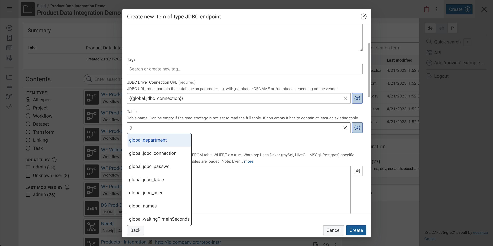

# Corporate Memory 23.1.1

Corporate Memory 23.1 is the first patch release in the 23.1 release line.

{ class="bordered" }
{ class="bordered" }
{ class="bordered" }

The highlights of this release are:

-   Build:
    -   Support for **global variables** in dataset and task parameters.
    -   Extensions to the Python Plugin API, including **autocompleted parameter** type and **password parameter** type.
-   Explore:
    -   Workspaces are now **selectable at runtime**.
    -   Enhanced **editing capabilities** in the EasyNav editor.
-   Automate:
    -   New **`admin user` command group** for managing user accounts in the Keycloak CMEM realm.

!!! warning

    With this release of Corporate Memory the DataManager configuration has changed and needs to be adapted according to the [migration notes below](#eccenca-datamanager).

This release delivers the following component versions:

-   eccenca DataPlatform v23.1.1
-   eccenca DataIntegration v23.1.1
-   eccenca DataIntegration Python Plugins v3.0.0
-   eccenca DataManager v23.1.3
-   eccenca Corporate Memory Control (cmemc) v23.1.1

More detailed release notes for these versions are listed below.

## eccenca DataIntegration v23.1.1

We're excited to bring you the latest update to DataIntegration v23.1, featuring numerous enhancements, bug fixes, and deprecations. This release introduces global variables support, Python Plugin API extensions, improved handling of replaceable datasets, and much more.

v23.1.1 of eccenca DataIntegration ships following fixes:

-   Fixed various vulnerabilities by upgrading affected libraries.
-   Workflows using the "SPARQL Update query" operator fail with "Need non-empty resource manager" errors.
-   use cmem-plugin-base 3.1.0 instead of RC1
-   remove some unused base image packages

v23.1 of eccenca DataIntegration adds the following new features:

-   Support for global variables:
    -   Dataset and task parameters can be set to Jinja templates.
    -   Templates may access configured global variables. User-defined variables will be added later.
    -   Global variable resolution is supported by the 'Evaluate template' transform operator.
    -   Disabled by default.
-   Extensions to the Python Plugin API:
    -   Autocompleted parameter types may declare dependent parameters.
    -   Password plugin parameter type.
    -   Custom parameter types can be registered
    -   For details, see changelog of the cmem-plugin-base module.
-   REST endpoint to search for properties in the global vocabulary cache:
    -   GET /api/workspace/vocabularies/property/search
    -   Warn of invisible characters in input fields and offer action to remove them from the input string.
-   Autocompletion of graph parameters.
-   Auto-completion support to linking rule 'link type' parameter.
-   Improve handling of replaceable datasets:
    -   Datasets that can be replaced/configured in a workflow at API request time can be set in the workflow editor.
    -   This allows for the execution of workflows with mock data, which has not been possible with 'Variable dataset' tasks.
-   Allow to config datasets as read-only to prevent accidentally writing into them.
-   New resource endpoints to replace the deprecated resource endpoints. See deprecation section for more details.
-   Allow to force start activity.
-   Rewritten linking evaluation view.

v23.1 of eccenca DataIntegration introduces the following changes:

-   Check token expiration (> 5s left) before sending a request to prevent unnecessary request retries.
-   'Concatenate' and 'Concatenate multiple values' transformer:
    -   In 'glue' parameter value support `\t`, `\n` and `\\` as escaped characters.
-   Indexing of levenshtein comparisons can be configured now.
-   Rename 'Constant' comparison operator to 'Constant similarity value'.
-   Neo4j improvements:
    -   Support for paths when reading entities (forward and backward operators).
    -   Using a relation at the end of a path will return the URI of the node.
    -   The `#id` special path will return the internal node id.
-   CSV dataset auto-configuration now supports detecting more encodings for the Charset parameter.
-   Changed search behavior in most places to search after typing stops instead of needing to hit the ENTER key:
    -   In the 'Create new item' dialog hitting the Enter key now has the same effect as clicking the 'Add' button.
-   Show value type label primarily instead of ID.
-   Show default URI pattern example in a object rule mapping form when the source path is non-empty.
-   Response body of a failed REST operator request is also added to the workflow report in addition to being logged.
-   Linking execution report has a warning message when the link limit was reduced because of the config of `linking.execution.linkLimit.max`.
-   Disable streaming in 'Parse JSON' operator, so backward paths can be used against it.
-   Improved online documentation of many rule operators:
    -   Distance measures: Added information if a measure is either boolean, normalized or unbounded.
    -   Distance measures: Clarified what happens with multiple values for single value measures.
    -   Transformers, Distance measures and Aggregators: Added examples

v23.1 of eccenca DataIntegration ships following fixes:

-   Layout breaks on small screens on detail pages of the workspace.
-   Mapping suggestion list is empty when there is no matching response even though source paths exist.
-   Active Learning shows incorrect entity values.
-   Add notes dialog keeps focus when workflow is executed and running.
-   Race condition in project/task tag selection.
-   Dataset auto-configure parameter changes not set for parameters that support auto-completion.
-   Label and description of existing root/object rules cannot be changed.
-   DI writes invalid XML, if the last segment of a URI starts with a number.
-   Optimize peak endpoint if only one path is requested.
-   Python Plugin Environment: package dependencies can not update the base requirements anymore.
-   Spinner is being shown eternally when no comparison pairs have been found in the link learning.
-   Value path auto-completion can suggest wrong paths if backward paths exist in the paths cache.
-   Show spinner while transform examples are requested from the backend.
-   Abort a not fully consumed S3 input stream instead of closing it which leads to warnings.
-   Date parser fails when no input/output pattern is selected even though an alternative input/output pattern is given.
-   Dependent parameter auto-completion using default values of other parameters.
-   Support replaceable/variable datasets in nested workflows.
-   Display info message when a parameter is disabled because it depends on other parameters to be set.
-   'Fix URI' operator trims the URI before fixing it and tries better to maintain the original URI with only the invalid characters encoded.
-   Task completion message is shown without executing the transformation.
-   Evaluation in mapping rule editor does not work when inside object mappings.
-   Show error message when project import fails because of errors detected in the backend instead of closing the project import modal.
-   Linking editor evaluation toolbar component issues.
-   Levensthein indexing slow if combined conjunctively.
-   Transform execution tab layout issues.

v23.1 of eccenca DataIntegration introduced the following deprecations:

-   Resource endpoints:
    -   All resources endpoints that have the _file path_ (`workspace/projects/:project/resources/:name`) encoded in the URL path are now deprecated. The files endpoints using a _query parameter_ for the path should be used now.

## eccenca DataIntegration Python Plugins v3.0.0

Corporate Memory v23.1 includes the DataIntegration Python Plugins support in version 3.0.0.

v3.0.0 of eccenca DataIntegration Python Plugins adds the following new features:

-   Autocompleted parameter types may declare dependent parameters. For instance, a parameter `city` may declare that its completed values depend on another parameter 'country':

    ```py
    class CityParameterType(StringParameterType):
        autocompletion_depends_on_parameters: list[str] = ["country"]
        def autocomplete(self,
                         query_terms: list[str],
                         depend_on_parameter_values: list[Any],
                         context: PluginContext) -> list[Autocompletion]:
           # 'depend_on_parameter_values' contains the value of the country parameter
           return ...
    ```

-   Password plugin parameter type. Passwords will be encrypted in the backend and not shown to users:

    ```py
    @Plugin(label="My Plugin")
    class MyTestPlugin(TransformPlugin):
    def __init__(self, password: Password):
        self.password = password

    # The decrypted password can be accessed using:
    self.password.decrypt()
    ```

-   Custom parameter types can be registered. See implementation of `PasswordParameterType` for an example.

## eccenca DataManager v23.1.3

We are excited to announce the latest update to DataManager v23.1, which introduces new features, improvements and bug fixes. This release brings enhancements to workspaces, editing capabilities in the EasyNav editor, and updates to the authentication system.

v23.1.3 of eccenca DataManager ships following fixes:

-   use latest debian:bullseye-20230411-slim base image
-   use wget instead of curl

v23.1.2 of eccenca DataManager was a redacted build due to incomplete merge.

v23.1.1 of eccenca DataManager ships following fixes:

-   Fixes link rules creation dialogue setting a target property.

v23.1 of eccenca DataManager adds the following new features:

-   Workspaces are selectable at runtime.
-   Routes can include a workspace selection.
-   Added Editing capabilities to the EasyNav editor.

v23.1 of eccenca DataManager introduces the following changes:

-   Configuration is now fully retrieved from DataPlatform, the included Spring Boot based backend is solely delivering the javascript frontend.
-   The configuration can be changed at runtime using a frontend in the `/admin` Module. Changes are visible with the next full browser reload.
-   Authentication is now based on the OAuth2 Code Flow.

v23.1 of eccenca DataManager ships following fixes:

-   Removed session token from URL.

## eccenca DataPlatform v23.1.1

We're excited to announce the latest update to DataPlatform v23.1, featuring significant improvements in caching, user rights management, and workspace configuration. This update also includes various bug fixes and the removal of deprecated properties. Here's an overview of the changes:

v23.1.1 of eccenca DataPlatform ships following fixes:

-   docker image: use latest debian:bullseye-20230411-slim base image
-   docker image: wget instead of curl

v23.1 of eccenca DataPlatform adds the following new features:

-   Added ability to use dynamic access conditions
-   Added graph for infos about logged in users (iri, login):
    -   Can be (de)activated using property `authorization.userInfoGraph.active` (default: true)
-   Workspace Selection and Configuration:
    -   Activate OAuth 2.0 client role permanently
    -   Redirect login page to (exactly) one configured resource provider
    -   REST endpoints for workspace configuration

v23.1 of eccenca DataPlatform introduces the following changes:

-   Integrate infinispan as sole cache provider:
    -   Enables clustering of DataPlatform instances
        -   clustering can be activated by `spring.cache.infinispan.mode=CLUSTER`
    -   Removed property `files.maintenanceCron` (housekeeping done by infinispan)
    -   Added property `files.storageDirectory` for configuring shared directory between multiple DataPlatform instances
    -   Replaced property `proxy.cacheInvalidationCron` with `proxy.cacheExpiration` (no scheduled flush anymore but cache expiration as default)
-   Changed logic of resolving user rights through access conditions - performance optimized

v23.1 of eccenca DataPlatform ships following fixes:

-   Prevent injection of formulas in Excel/CSV exports
-   Diagnostic store operations / query rewrite log on logging topic `com.eccenca.elds.backend.sparql.query.diagnostic` - must be set to TRACE:
    -   Activated update result statistics in existing query result logger
-   Missing access condition action resource for EasyNav added

v23.1 of eccenca DataPlatform removed the following features and configurations:

-   Deprecated properties under authorization.accessConditions
    -   `authorization.accessConditions.graph`: used graph is always the default graph from bootstrap
    -   `authorization.accessConditions.url`: url as source for access condition not supported anymore

## eccenca Corporate Memory Control (cmemc) v23.1.1

We are excited to announce the latest updates to eccenca Corporate Memory Control v23.1, which brings new features and improvements.
This release introduces new command functionalities, configuration options, and a change in the project structure.

v23.1.1 of eccenca Corporate Memory Control introduces the following changes:

-   remove some unneeded packages from docker image
-   switch to python 3.11.3 base image and tests

v23.1 of eccenca Corporate Memory Control adds the following new features:

-   `admin status` command:
    -   option `--exit-1` to specify, when to return non-zero exit code
    -   currently set to `never`, this will be changed to `always` in the future
-   `admin user` command group:
    -   `create` command - add a user account to the keycloak CMEM realm
    -   `delete` command - remove a user account from the keycloak CMEM realm
    -   `list` command - list user accounts in the keycloak CMEM realm
    -   `password` command - change the accounts password
    -   `update` command - change a user account in the keycloak CMEM realm
-   optional `KEYCLOAK_BASE_URI` config environment
-   optional `KEYCLOAK_REALM_ID` config environment

v23.1 of eccenca Corporate Memory Control introduced the following deprecations:

-   `admin status` command `--exit-1` option default
    -   currently set to `never`, this will be changed to `always` in a future release

## Migration Notes

!!! warning

    We do not guarantee forward compatibility for configuration, data or projects.
    I.e. importing a project created with DataIntegration v23.1 into DataIntegration v22.2 (or older) might not work.

    Backward compatibility will be ensured or migration paths explained.
    I.e. projects created with DataIntegration v22.2 can be imported into DataIntegration v23.1.

### eccenca DataIntegration

-   Resource endpoints:
    -   All resources endpoints that have the _file path_ (`workspace/projects/:project/resources/:name`) encoded in the URL path are now deprecated.
    -   Use corresponding endpoints starting with `workspace/projects/:project/files` instead, using a _query parameter_ for the file path.

### eccenca DataIntegration Python Plugins

The signature of the autocomplete function has been changed.
All autocomplete implementations need to be updated to the following signature:

```py
def autocomplete(self, query_terms: list[str], depend_on_parameter_values: list[Any], context: PluginContext) -> list[Autocompletion]
```

Parameters using the old signature will continue to work for one release, but a warning will be printed in the log.

The same applies to the label function that has been updated to the following signature:

```py
def label(self, value: str, depend_on_parameter_values: list[Any], context: PluginContext) -> Optional[str]
```

### eccenca DataManager

-   A manual migration for the graph based configuration of the EasyNav configuration and the graph list configuration of the explore module is necessary.
-   A manual migration for the `.yml` based DataManager configuration is necessary.
-   The new web based configuration tool can be used to migrate, create and manage your DataManager (workspace) configuration

### eccenca DataPlatform

-   Deprecated properties under `authorization.accessConditions` have been removed. The used graph is always the default graph from bootstrap, and URL as a source for access conditions is not supported anymore.
