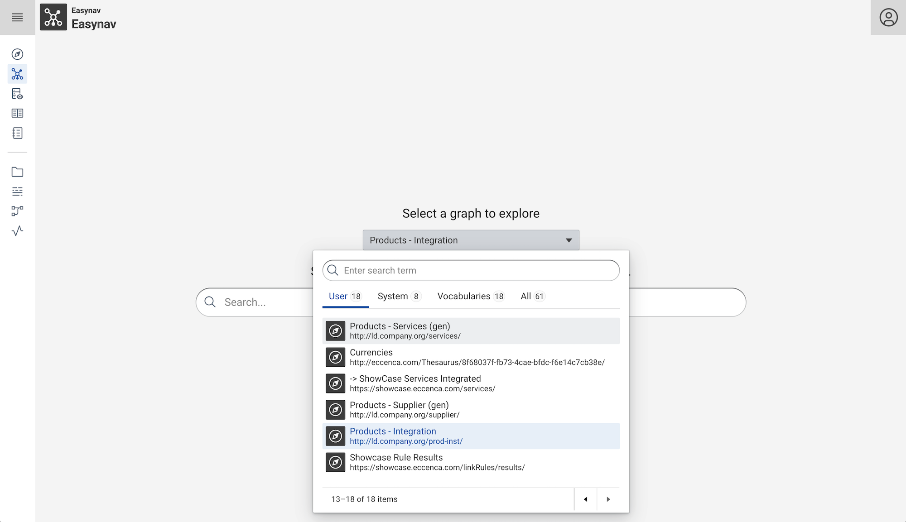

# Corporate Memory 23.2

Corporate Memory 23.2 is the second major release in 2023.

{ class="bordered" }
{ class="bordered" }
{ class="bordered" }

The highlights of this release are:

-   Build:
    -   Support for user managed **project variables** in dataset and task parameters.
    -   All new UIs for **transformation evaluation and reference links**.
-   Explore:
    -   New feature in Easynav like
        -   **nodes context menu**,
        -   **long label support**,
        -   advanced **graph selection dialog** and
        -   **automatic node layout**.
-   Automate:
    -   New **`admin client` command group** for managing client accounts in the Keycloak CMEM realm.

This release delivers the following component versions:

-   eccenca DataPlatform v23.2.1
-   eccenca DataIntegration v23.2.1
-   eccenca DataIntegration Python Plugins v4.1.0
-   eccenca DataManager v23.2
-   eccenca Corporate Memory Control (cmemc) v23.2

More detailed release notes for these versions are listed below.

## eccenca DataIntegration v23.2.1

We're excited to bring you the latest update to DataIntegration v23.2, featuring numerous enhancements, bug fixes, and deprecations.

v23.2.1 of eccenca DataIntegration ships the following improvements and fixes:

-   Added overview listing all available keyboard shortcuts, available by `?` key, or from the user menu.
-   Improved vocabulary (needs to be installed separately).
-   The file API will set the content type based on the file extension:
    -   For instance, for a file ending in `.json` the `Content-Type` header will be set to `application/json`.
-   Upgraded several libraries to fix vulnerabilities.

v23.2 of eccenca DataIntegration adds the following new features:

-   User-defined project variables:
    -   Can be used in dataset and task parameters and in the template transform operator.
    -   Variables may use templates that access other preceding project variables or globally configured variables.
-   All new transform evaluation UI.
-   All new reference links view.
-   Extensions to transform rule and linking rule editors:
    -   Support for setting a language filter for a path operator conveniently without having to use the language filter syntax.
    -   Partial linking and transform rule (tree) evaluation.
-   Support fixing tasks that have failed loading:
    -   Allow a user to reload a task. The user may change the original parameters of the task.
    -   `POST /api/workspace/projects/{projectId}/reloadFailedTask` endpoint that reloads a task with optionally updated parameter values.
    -   `GET /api/workspace/projects/{projectId}/failedTaskParameters/{taskId}` endpoint that fetches the original parameter values of a failed task.
-   Added "Concatenate pairwise" transform operator.
-   Make transform suggestion matching link spec / workflow customizable.
-   API extensions:
    -   Transform evaluation endpoint: `/transform/tasks/{projectId}/{transformTaskId}/rule/{ruleId}/evaluated`
    -   Added endpoints for uploading and downloading files of datasets.
    -   REST endpoint to fetch dataset characteristics.
        -   `GET /api/workspace/projects/(projectId)/datasets/{datasetId}/characteristics`
    -   API endpoint to fetch IDs of file based datasets.
        -   `/api/core/datasets/resourceBased`
    -   REST endpoint to copy an arbitrary linking task to the matching linking task that will be used in the mapping suggestion.
        -   `POST /ontologyMatching/replaceOntologyMatchingLinkSpec`
        -   Both `matching.external.projectId` and `matching.external.linkSpecId` must be configured
    -   REST endpoint that generates an ontology matching project and linking tasks based on a specific transformation task.
        -   `POST /ontologyMatching/generateMatchingLinkRule`

v23.2 of eccenca DataIntegration introduces the following changes:

-   Close user menu automatically.
-   Linking rule config:
    -   Add 'Inverse link type' parameter that defined a URI that is generated from the target to the source resource, i.e. the inverse of the 'link type' parameter.
    -   Add 'Is reflexive' parameter that when enabled does not link resources with themselves.
-   In a workflow datasets with schema-less inputs, e.g. workflows, other datasets, are not considered to be outputs datasets anymore.
-   Variable workflow API:
    -   Support uploading large input files via multipart/form-data request
    -   Support custom mime type "application/x-plugin-<PLUGIN_ID>" in CONTENT-TYPE or ACCEPT in order to support all file based dataset plugins.
    -   Support query parameters 'config-dataSourceConfig-<PARAMETER_ID>' and 'config-dataSinkConfig-<PARAMETER_ID>' to configure dataset parameters of the data source and sink.
-   Added read-only / uriProperty dataset attributes to endpoint responses.
-   forward cmem-plugin-base to v4.1.0, via base image v2.2.0
-   The handling of errors in transform rules has been aligned with what is already shown in the evaluation:
    -   If a nested operator throws a validation error (e.g., if the input value is not a number for numeric operators), this no longer leads to a failure of the entire rule.
    -   The error will be added to the execution report.
    -   Failed operators will return no value.

v23.2 of eccenca DataIntegration ships the following fixes:

-   Excel plugins are not available (CMEM-5088).
-   Transform/linking tasks with operators that use projects resources, e.g. Excel transform, cannot be copied/cloned to other projects (CMEM-5065).
-   Using a target property ending in `/valueOf` for a value mapping rule breaks the mapping editor (CMEM-5059).
-   Re-configured pure input dataset in a workflow should not be seen as an output dataset (CMEM-5058).
-   Prioritized and blocking activities should be run in a fork join pool as well (CMEM-4856).
-   Workflow(s) info endpoints return error (500) when a workflow is invalid (CMEM-5099):
    -   There is a 'warnings' property in the returned JSON that describes which information is missing and why.
-   Remove broken legacy navigation menu from client error template that is shown e.g. when a user is not authorized to use DI (CMEM-4977).
-   Mapping editor: the path suggestion that exactly matches the search query is not shown in the list of suggestions (CMEM-5084).

## eccenca DataIntegration Python Plugins v4.1.0

Corporate Memory v23.2 includes the DataIntegration Python Plugins support in version 4.1.0.

v4.1.0 of eccenca DataIntegration Python Plugins adds the following new features:

-   use `post_resource` api in `write_to_dataset` function to update dataset file resource
-   use cmempy 23.2
-   upgrade dependencies
-   enforce usage of Python 3.11

## eccenca DataManager v23.2

We are excited to announce the latest update to DataManager v23.2, which introduces new features, improvements and bug fixes.

v23.2 of eccenca DataManager adds the following new features:

-   Added advanced options ("Inverse Linking Property" and "Irreflexive Linking") in a Link rule setup Dialog.
-   Automatic layouts in Easynav.
-   Configurable defaultTimeout for queries.

v23.2 of eccenca DataManager ships the following changes:

-   Auto-close user menu.
-   Delete Resource Dialog was overhauled, and can now trigger a `shui:onDeleteUpdate` query.
-   Adjusted the payload when saving a custom or the default workspace config so that it has only the modified values.
-   Better error message for empty string after stopwords remove in the Easynav module.
-   Allow stale facets initially to improve loading timing. After stale facets are fetched, actual ones will be requested in background.
-   Easynav:
    -   Long labels are shown in two lines.
    -   Save option for saving only the ontology changes.
    -   Context menu on resource nodes is re-enables.
    -   Query based entry into Easynav via the "graph" tab in explore.
    -   Context graph name is shown in breadcrumbs.
    -   Detailed filtering in the visualization catalog.
    -   Search bar centers on the node.
    -   All possible connections are shown for a node, not just the ones with data.
    -   Rich graph selection widget.
-   Pathbuilder:
    -   Added subpaths option if `hierarchyEnable` is true.
    -   Added server search for subject and predicate.
    -   Added support for longer labels in resource selector.
    -   Added helper texts for subject selection and subpaths selection.
    -   Added depictions for subjects and predicates.
    -   Added different colors for subpaths.
-   Explore/Properties View:
    -   Geo-coordinates are only shown, when a map server is configured.
    -   The wording of the error message when no selected graph found is changed.

v23.2 of eccenca DataIntegration ships the following fixes:

-   Replaced an obsolete `LabelResolutionApi` by RTK-Query to catch 401 errors (lost session/authorization) and bring cache (CMEM-4979).
-   Restored notifications toast (CMEM-4979).
-   Enabled deletion of large tables (CMEM-4898).
-   Added `mapServer` options in explore config (CMEM-4926).
-   Error message shows when trying to upload broken file to the graph (CMEM-4704).
-   Fixed error with lost graph list tabs on workspace switch (CMEM-5087).

## eccenca DataPlatform v23.2.1

We're excited to bring you the latest update to DataPlatform v23.2, featuring numerous enhancements, bug fixes, and deprecations.

v23.2.1 of eccenca DataPlatform ships following fixes:

-   Bootstrap Data: Removed obsolete DataIntegration vocabulary from shape catalog

v23.2 of eccenca DataPlatform adds the following new features:

-   Bootstrap Data: allow `sh:order` for `sh:NodesShape`.
-   Dynamic access conditions backend functionality.
-   Add optional facets request param for getting (possibly) stale cached values.
-   Provenance metadata for Easynav visualizations.
-   Added property `hierarchyEnable` to Link Rule Modul.
-   Added properties for `mapServer` to Explore Modul.
-   Add node shape property shape for `onDeleteUpdate` of resource.
-   Added DI vocabulary.
-   Added provenance metadata to visualization catalogue entries.

v23.2 of eccenca DataPlatform ships the following changes:

-   PropertyUsage endpoint delivers language tags.
-   Make order of node shapes editable.
-   Resolving of depictions for resource along node shape order.
-   Viewing labels of NodeShapes as `SHACL.Name` - changed from `RDFS.Label`.
-   Resource deletion applies Symmetric Concise Bound Description including incoming links.
-   Show full list of access conditions for users with access condition management action.
-   Add configuration option to switch between ontodia / graph tab in explore view.

v23.2 of eccenca DataPlatform ships following fixes:

-   Prevent upload of incorrect file URIs (CMEM-4360).
-   Reintroduce `defaultTimeout` for UI queries (CMEM-5100).
-   Make property `defaultGraph` able to be overwritten in custom workspace (CMEM-4902).
-   Fix labels of node shapes from `RDFS.Label` to `SHACL.Name` (CMEM-4743).

## eccenca Corporate Memory Control (cmemc) v23.2

v23.2 of eccenca Corporate Memory Control adds the following new features:

-   `admin user password` command:
    -   option `--request-change` added, to send a email to user to reset the password
-   `dataset create` command:
    -   add `readOnly` and `uriProperty` keys for the `-p/--parameter` option
-   `admin client` command group:
    -   `list` command - list client accounts
    -   `open` command - Open clients in the browser
    -   `secret` command - Get or generate a new secret for a client account
-   `project create` command:
    -   new option `--from-transformation` to create a mapping suggestion project

v23.2 of eccenca Corporate Memory Control introduces the following changes:

-   `dataset upload` command:
    -   use new endpoint which is aware of read-only datasets
-   `workflow io` command:
    -   use of extended io endpoint
    -   allows for uploading bigger files
    -   allows for more input and output mimetypes
    -   change default output to JSON

## Migration Notes

!!! warning

    We do not guarantee forward compatibility for configuration, data or projects.
    I.e. importing a project created with DataIntegration v23.2 into DataIntegration v23.1 (or older) might not work.

    Backward compatibility will be ensured or migration paths explained.
    I.e. projects created with DataIntegration v23.1 can be imported into DataIntegration v23.2.

No component specific migrations are required going from 23.1 to 23.2.
