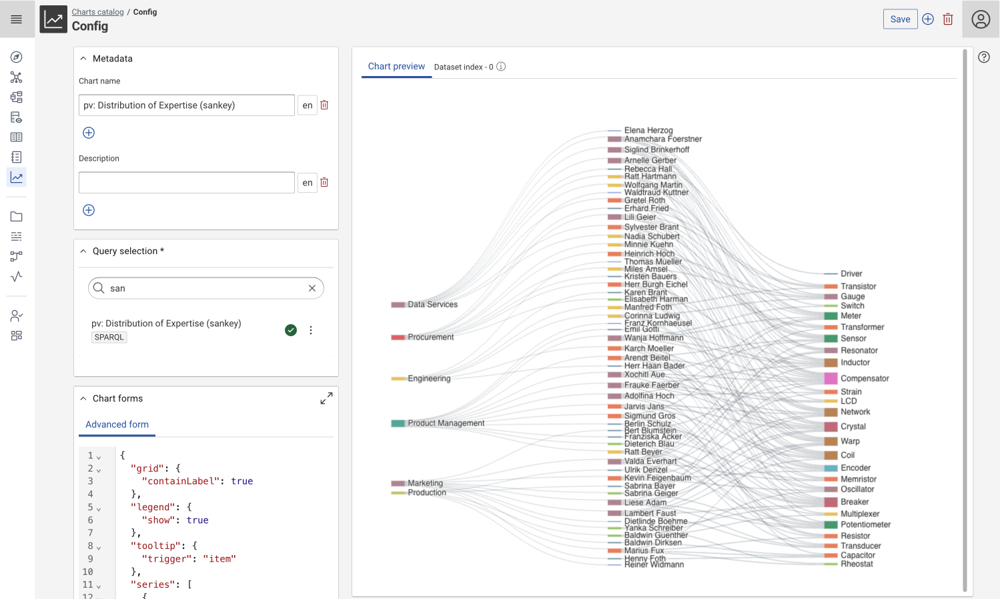
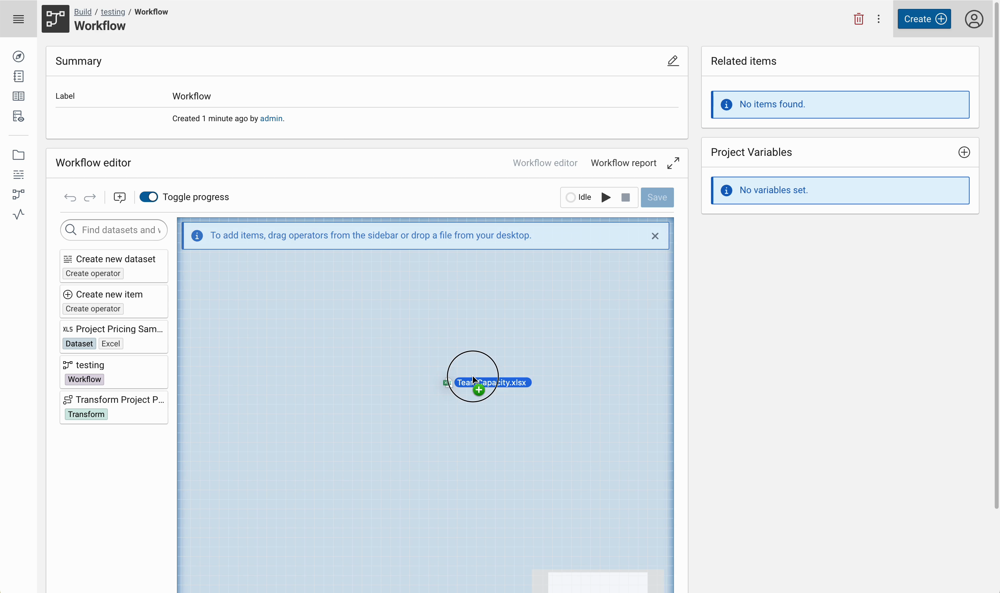

# Corporate Memory 24.2.1

Corporate Memory 24.2.1 is the first patch release in the 24.2 release line.

 based Data Exploration"){ class="bordered" }
{ class="bordered" }
{ class="bordered" }

The highlights of this release are:

-   Explore and Author:
    -   All-new, re-written shacl custom UI rendering engine (shacl2) is now generally available and the system default
    -   Support for Sankey chart type.
-   Build:
    -   Quick creation of file based datasets in the workflow editor - dropping files into the workflow editor will automatically create a new dataset.
-   Automate:
    -   Extension to many **import commands** to allow for importing graphs, projects, datasets and vocabularies from the web
    -   Extension to the **graph validation export** command to produce JUnit XML reports for better integration into CI/CD pipelines

This release delivers the following component versions:

-   eccenca DataIntegration v24.2.1
-   eccenca DataManager v24.2.1
-   eccenca DataPlatform v24.2.1
-   eccenca Corporate Memory Control (cmemc) v24.2.0

We tested this release with the following dependency components:

-   Ontotext GraphDB v10.7.2
-   Keycloak v25.0.6

More detailed information for this release is provided in the next sections.

## eccenca DataIntegration v24.2.1

We're excited to bring you the latest update to DataIntegration v24.2, which introduces new features, improvements and bug fixes:

v24.2.1 of DataIntegration ships the following fixes:

-   Drag and drop in react flow editors used in Linking and Transform tasks work again.
-   Dragging operators in the react flow based editors when text is selected leads to large artifacts.

v24.2.0 of DataIntegration adds the following new features:

-   Quick creation of file based datasets in the workflow editor.
    -   Dropping files into the workflow editor will automatically create a new dataset.
-   Button to reload all cache activities at once.
-   The JDBC dataset can now be configured how it will write multiple values for a single property. A new strategy allows to write multiple rows in this case.
-   Python:
    -   Added `WorkflowContext` that allows plugins to access the workflow identifier as well as the current execution status.
    -   Added `packageName` attribute to the plugin JSON.

v24.2.0 of DataIntegration introduces the following changes:

-   Re-use original parameters of a replaceable dataset if the dataset type matches with the requested one in a variable workflow request.
-   Support Turtle files for the graph file upload operator (No chunking supported)
-   Transform object header has been separated from its properties to improve visual appearance.
-   Rule editors: Add generic path operator to input path tabs.
-   When trying to execute an unsaved workflow notify the user that the workflow will be saved with the option to not show the dialog again.
-   Re-added reload button to data preview to get updated content on config and data changes.
-   Removed URL resource manager. URLs as file names won't be resolved anymore, e.g. for dataset inputs.
-   The RDF datasets will always write the schema type for each entity.

v24.2.0 of DataIntegration ships the following fixes:

-   Workflow Task: exception message prefixed with wrong name.
-   Workflow editor:
    -   Workflow nodes with only a single dependency output might be executed twice.
    -   Loose connections from dependency ports not working anymore.
    -   Allow dependency connection from/to replaceable datasets.
    -   Drawing dependency connections from input dependency port results in unexpected connections, e.g. connections to data output ports.
-   Project page breaks if file resources are missing meta data like size or modified.
-   Workflow operator: became invisible after workflow error.
-   Always return a 401 (not authorized) instead of a 500 response when refreshing a token has failed with an `invalid_grant` error from Keycloak.
-   Rule endpoint does not return new parameters after plugin upgrade.
-   Zip file created with macOS Archive Utility containing files with macOS-specific metadata not working in bulk datasets.
-   Fixed `overlayEditors` that close even with unsaved changes.
-   Consistent navigation behavior or indicate links/buttons that open a new tab/window.
-   Replace `highlightedState` properties in workflow editor.
-   Rule endpoint does not return new parameters after plugin upgrade.
-   Python: Changes in plugin submodule not recognized without restarting DI.
-   Dataset API is not fenced against misuse of file parameter.
-   Workflow Task: exception message prefixed with wrong name.
-   Improve upload icon in DI file upload widget.
-   JDBC: H2 driver not found.
-   JDBC: Dataset should not write an extra `rdf_type` column.
-   JDBC: Cannot rerun Data preview without reopening JDBC dataset update dialog.
-   JDBC: naming the URI column `uri` causes `is ambiguous` error.

## eccenca DataManager v24.2.1

We are excited to announce the latest update to DataManager v24.2, which introduces new features, improvements and bug fixes.

v24.2.1 of DataManager ships the following fixes:

-   Fixed _Create `<type>`_-Button in explore
-   Select NodeShapes according to their `sh:order`
-   Resolve NodeShapes sequentially, instead of parallel
-   Node selection clears its state when deleting nodes
-   Easynav: non-saved values disappear after search value change
-   Resource list is updated after the creation of a new resource
-   Newly created relations based on inverted shapes are pointing in the right direction
-   Setting language for text areas

v24.2.0 of DataManager adds the following new features:

-   _Charts module_
    -   Support for grouping chart series.
    -   Support for Sankey chart type.
-   _Business Knowledge Editor - EasyNav_
    -   Easynav allows to create new, directly connected resources with the via the browse dialogue.
    -   Improved undo/redo functionality.
    -   Improved internal structure and robustness.
    -   Improved selection and searching.
    -   Adding new connections via shacl shape queries.
    -   Adding new connections on unsaved nodes.
    -   Unique Visualization names are enforced.
-   _Other_
    -   Added a global notifications queue with the dropdown menu besides the user menu.
    -   Update Spring Wrapper to Spring Boot 3.2.
    -   Added icons for read-only graphs.
    -   Added "algorithm" param in workspace configuration and `/proxy/:id/resource` queries.
    -   Added a notification feature for retrieving the query catalog data when the backend response contains validation errors with the code "DOUBLE_TRIPLE".
    -   Added the multi-source turtle component.

v24.2.0 of DataManager ships the following changes:

-   _SHACL Component_ - SHACL2 replaces now our default SHACL viewer/editor and brings in lot of new features and enhancements.
    Note: this component was already introduced in v24.1, so this list is not exhaustive.
    -   Improved Validation of inputs.
    -   Added the possibility to add properties that are not visible to shacl2.
    -   Migrated annotations to shacl2.
    -   Value and UI Query are used in relation manager, if provided.
    -   Added check for simple widget using `defaultResourceViewerIri`.
    -   Improved editor for highly connected resources.
    -   Improved access condition handling when creating new resources.
    -   Improved default language handling.
    -   Improved Layout for long labels.
    -   Partial support for qualified value shapes.
    -   Sticky toolbar for better usability.
-   _Access Conditions_ - New Access conditions management interface replaces the former component.
    -   Validation for the creation items, added links to grid items.
    -   AC review page.

v24.2.0 of DataManager ships the following fixes:

-   _Error messages_
    -   Improved error messages format, now they are more informative and user-friendly with title and details sections.
    -   Warnings are shown locally where triggered and errors are added to the global notifications queue.
    -   Warnings are shown properly without breaking the UI, closer to the place that triggered it.
-   Workflow triggers reload the page after the workflow is finished.
-   Resource tags are links.
-   _Explore_
    -   Navigation component honors the module settings for navigationItemsPerPage.
    -   Navigation component shows correct pagination for search.
    -   Turtle tab is visible, even if the user has no write access.
-   _Business Knowledge Editor - EasyNav_
    -   Inverse properties are shown in the correct direction.
    -   Labels with more than approx. 24 characters and no white space are now correctly split into two lines.

## eccenca DataPlatform v24.2.1

We're excited to bring you the latest update to DataPlatform v24.2, which introduces new features, improvements and bug fixes:

v24.2.1 of DataPlatform ships the following fixes:

-   Backup archives are zipped with ZIP64 option to allow >=4G archives
-   Prevent issues with long-running shacl batch jobs on single node deployments
-   Include subclasses in validation of `sh:class`
-   Improved validation of file uploads

v24.2.0 of DataPlatform adds the following new features:

-   Added migration of workspace configuration
    -   workspace/module configurations are stored in JSON content literals in the CMEM Config Graph since v23.1.
    -   New field <https://vocab.eccenca.com/configuration/json.ver> in workspace configuration graph.
    -   Endpoint for migrating workspace configurations to current version.
    -   Extension of actuator info endpoint: Shows current version and number of items to migrate.
-   Added SHACL RDF validation view for SHACL batch validations, `POST /api/shacl/validation/batches`
    -   `validationResultsTargetGraph`: Graph to write rdf validation model into after batch finishes
    -   `replace`: boolean value on whether to replace the graph (default: false)
-   Added option for SHACL Batch run to query target resources with a ignore list for OWL imports, `POST /api/shacl/validation/batches`
        -   `owlImportsIgnoreList`: A set of graph IRIs which are not queried in the resource selection (i.e. owl imports ignored)
-   Added module Access-Control to workspace configuration
    -   Existing module Administration split into workspace configuration and access control.
    -   Existing administration module used for workspace configuration (as to avoid migration steps).
-   Add alternative endpoint to `/api/shapes/list` called `/api/shapes/listWithValidation`
    -   return object contains a field for errors in the data which prevent mapping.
    -   asked behavior results in shape not found responses on shapes which cannot be mapped
-   Add `owlImportsResolution` to resource store endpoints
    -   optional parameter overriding dataplatform setting

v24.2.0 of DataPlatform ships the following changes:

-   Update to Apache Jena 5
    -   All JSON-LD output in JSON-LD 1.1, JSON-LD 1.0 support dropped
-   Changed to Access Condition endpoints
    -   `GET /api/authorization/groups` return IRIs instead of names (including public/admin group)
    -   `GET /api/authorization splits` pageable parameter into single parameters page, size, sort
-   Deactivated graph db change tracking as default
-   Extension of ACL review endpoint, response updated with matching access conditions
-   Additional SHUI-Property for defining object relation default view
    -   `shui:viewResourcesWithWidget` with values (`shui:ComplexResourceViewerWidget`, `shui:SimpleResourceViewerWidget`)
-   Resource API endpoints `/proxy/{id}/resource` changed
    -   Additional application parameter proxy.maxCBDStatements (default: 1000000) for limiting amount of statements in memory when loading (S)CBD
    -   CBD calculation does not include reifications anymore
    -   Additional one query based algorithm for CBD calculation (algorithm can be selected with optional query parameter algorithm)
        -   workspace configuration: `apiConfiguration.conciseBoundLoadAlgorithm` (`ITERATIVE`, `QUERY`)
-   Endpoint for workspace configuration set `/api/conf/workspaces` falls back on system default
-   New default icons for resource, class and properties
-   Removal of native stardog integration

v24.2.0 of DataPlatform ships the following fixes:

-   Broken workspace configurations fall back to system default workspace
    -   actuator info endpoint contains field `workspaceConfigurationError` on error
-   SHACL controller validation endpoint fixed
    -   only validates constraints which do not need other data if change-set is given as in memory
-   Fixed query rewriting of (named) graphs for users with limited read rights
    -   From Graphs Rewriting: Prevent rewrite of where clause if no graph variable found

## eccenca Corporate Memory Control (cmemc) v24.2.0

We're excited to bring you the latest update to Corporate Memory Control (cmemc) v24.2, which introduces new features, improvements and bug fixes:

v24.2.0 of Corporate Memory Control (cmemc) adds the following new features:

-   `admin store migrate` command
    -   Migrate configuration resources to the current version.
-   `admin status` command
-   -   will warn in case there a workspace configurations, which can be migrated
-   -   will exit with exit code 1 in case option `--exit-1 always` is given and migratable workspaces are found
-   `graph validation export` command
    -   export validation reports as JSON or jUnit XML
-   `graph import` command
    -   support for importing graphs from remote HTTP/HTTPS locations
-   `project import` command
    -   support for importing project zip files from remote HTTP/HTTPS locations
-   `dataset create` command
    -   support for creation of resource file from remote HTTP/HTTPS locations
-   `dataset upload` command
    -   support for uploading of resource file from remote HTTP/HTTPS locations
-   `vocabulary import` command
    -   support for importing vocabulary from remote HTTP/HTTPS locations
-   `smart_path` package as a replacement for `pathlib.Path` and expanded functionality to support both local file paths and remote file paths
-   `ClickSmartPath` parameter type, extending `click.path` to accommodate remote files
-   `graph validation execute` command group
    -   option `--query` to allow specifying a select query for resource selection.
    -   option `--ignore-graph` to provide multiple graph IRIs to be excluded from the resource selection.
    -   option `--result-graph` to specifies the graph where the validation results will be written.
    -   option `--replace` to replace the result graph with new validation results

v24.2.0 of Corporate Memory Control (cmemc) ships the following fixes:

-   `graph import` command
    -   importing a directory to a single graph no longer raises an error but imports all turtle files to this graph
-   `admin workspace python install` command
    -   report errors from update_plugins API
-   using not existing configurations (`-c` / `--configuration`) now results in a proper error message
-   `workflow io` command
    -   can now generate ttl output files
-   `admin workspace python list` command
    -   listing of published packages with the `--available` option now works for more than 19 packages
-   `graph export` command
    -   newly created directories have correct access conditions now
-   `vocabulary install` command
    -   raise proper usage error messages
-   `vocabulary uninstall` command
    -   raise proper usage error messages
-   `admin store export` command
    -   validates the exported zip and raises an error in case of a corrupted ZIP export

## Migration Notes

!!! info

    We do not guarantee forward compatibility for configuration, data or projects.
    I.e. importing a project created with DataIntegration v24.2.0 into DataIntegration v24.1.0 (or older) might not work.

    Backward compatibility will be ensured or migration paths explained.
    I.e. projects created with DataIntegration v24.1.0 can be imported into DataIntegration v24.2.0.

### DataIntegration

If during writing to a MySQL/MariaDB a `[…] You have an error in your SQL syntax […]` error is encountered make sure `ANSIquotes` are used.

`sql_mode=ANSI_QUOTES` can be set via a URL parameter to the JDBC connection string like:

```txt
# MySQL
jdbc:mysql://<host>:<port, eg. 3306>/<database>?sessionVariables=sql_mode=ANSI_QUOTES

# MariaDB
jdbc:mariadb://<host>:<port, eg. 3306>/<database>?sessionVariables=sql_mode=ANSI_QUOTES
```

### DataManager

`shacl2` feature flag was removed, the Shacl2 engine is now the system default. In case you had the `shacl2` feature flag set in the workspace configuration, it can now be removed.

### DataPlatform

-   Due to the update to Apache Jena 5 all JSON-LD output now conforms to JSON-LD 1.1 (was JSON-LD 1.0):
    -   JSON-LD 1.1 has been designed as a superset of 1.0, so we do not expect any problems, just making you aware that there _might_ be differences when using it with JSON-LD 1.0 and 1.1 processors at the same time (e.g. to compare results)
        > JSON-LD 1.1 introduces new features that are compatible with JSON-LD 1.0, but if processed by a JSON-LD 1.0 processor may produce different results (cf. [JSON-LD 1.1 Framing](https://www.w3.org/TR/json-ld11-framing/#features))
    -   Affected endpoints:
        -   `POST /proxy/{id}/resource/framed`
        -   `POST /proxy/{id}/sparql/framed`
        -   `POST /authorization/conditions/framed`
        -   `POST+GET /api/queries/jsonld/perform`
-   The Access Condition endpoint `GET /api/authorization/groups` returns now IRIs instead of names (including public/admin group).
-   Resource API endpoints `/proxy/{id}/resource` changed, the CBD calculation does not include reifications anymore.
-   The native stardog integration has been removed. As a stardog user you need to migrate your store configuration to use the generic HTTP-Store configuration option.

### cmemc

- The [`admin status`](../../automate/cmemc-command-line-interface/command-reference/admin/index.md#admin-status) command in combination with the `--exit-1 always` option now exits with status code 1 in the additional case that migrate-able workspace configurations are found
    -   To avoid this, you can automatically migrate the configurations with the [`admin store migrate`](../../automate/cmemc-command-line-interface/command-reference/admin/store/index.md#admin-store-migrate) command.

