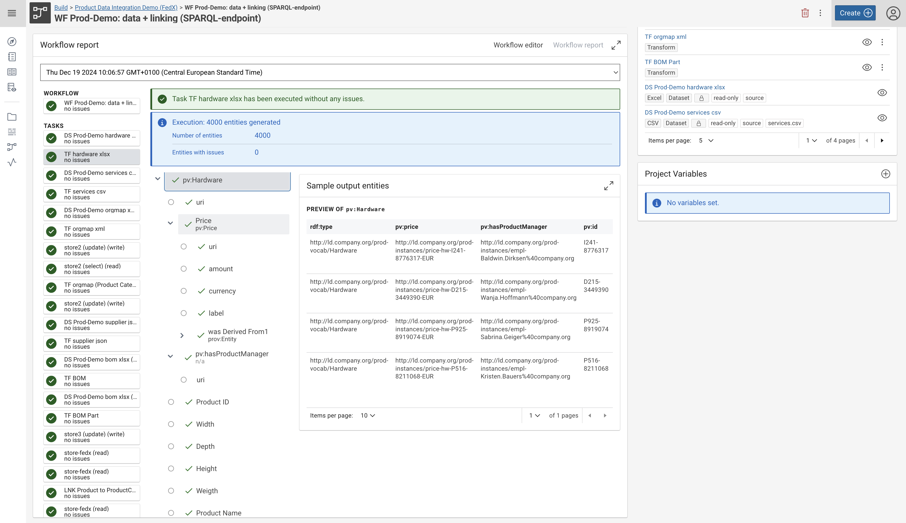
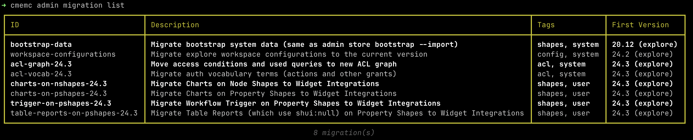

# Corporate Memory 24.3.2

Corporate Memory 24.3.2 is the third major release in 2024.

 based dossier view"){ class="bordered" }
{ class="bordered" }
{ class="bordered" }

The highlights of this release are:

-   Explore and Author:
    -   New shacl2 engine now used in the Business Knowledge Editor sidebar for a whole new experience when viewing and editing node details.
-   Build:
    -   Workflow reports now show a preview of the output entities being produced, allowing quick review and verification of the underlying workflow tasks..
-   Automate:
    -   The `cmem` command group `admin migration`, which adds various migration recipes to make it easier to upgrade to new versions of Corporate Memory.

!!! info inline end "Important info"

    Since v24.3.0, the components eccenca DataPlatform and eccenca DataManager are merged into a single component eccenca Explore.

This release delivers the following component versions:

-   eccenca DataIntegration v24.3.1
-   eccenca Explore v24.3.0 (formerly DataPlatform and DataManager)
-   eccenca Corporate Memory Control (cmemc) v24.3.2

We tested this release with the following dependency components:

-   Ontotext GraphDB v10.8.3
-   Keycloak v25.0.6

More detailed information for this release is provided in the next sections.

## eccenca DataIntegration v24.3.1

We're excited to bring you the latest update to DataIntegration v24.3, which introduces new features, improvements and bug fixes:

**v24.3.1 of DataIntegration adds the following new features:**

-   Added download button to workflow report tab.

**v24.3.1 of DataIntegration ships the following fixes:**

-   Task descriptions with long strings do not lead to horizontal scroll bars.
-   Tag search might very shortly show old search suggestions.
-   Missing unit for _Matching timeout_.
-   _Regex selection_ transformer has mis-formatted documentation.
-   Added JDBC dataset documentation on how to configure ANSI quotes for MySQL.
-   Superfluous `CREATE SILENT GRAPH` leads to slow update performance.
-   Fix SQL editor inputs.

**v24.3.0 of DataIntegration adds the following new features:**

-   Workspace search:
    -   Support to filter workflows that contain replaceable datasets.
    -   Display tags on workflow search items when they contain replaceable datasets.
    -   Add file name and graph URIs to search items as searchable tags.
-   Workflow editor:
    -   Support creating knowledge graph datasets from DataPlatform graphs matching the search query.
    -   Added copy prefixes option in copy task dialog.
-   Integration of a Prometheus endpoint to expose many useful metrics.
-   Transform operators to retrieve attributes from input tasks:
    -   _Input Task attributes_ retrieves individual attributes from the input task (such as the modified date) or the entire task as JSON.
    -   _Input file attributes_ retrieves a metadata attribute from the input file (such as the file name).
-   JdbcDialect implementation for Trino: Fixes STRING type mapping, adds isolationLevel option to avoid Connections resetting AutoCommit mode and serves as example for the dialect concept.
-   File hash transformer:
    -   Calculates the hash sum of a given file
    -   Works on either the input file dataset or a selected file from the project
-   JSON special paths:
    -   `#propertyName` accesses the current object key
    -   `*` selects all direct children of the current token
-   Add link from a task parameter description into the task's Markdown documentation for this parameter, if available.
-   Show sample (output) entities for workflow operators in the workflow reports.
-   Text dataset allows to configure the zip regex.
-   Support setting the locale for the `Parse date pattern` and `Parse date` transform operators.
    -   `*` selects all direct children of the current token
-   More fine-grained access control:
    -   In addition to a base action, it is possible to specify as many specific actions that protect specific endpoints.
    -   Endpoints are configured in a whitelist as URI prefixes per specific action.
    -   All endpoints that are protected by any specific action cannot be accessed anymore via the base action.
    -   Two new actions are configured by default and protect the Python plugin management and specific workspace API endpoints. See changes and migrations.
-   Global variables can be marked sensitive for storing passwords:
    -   Sensitive variables can only be used in password fields.
    -   Using sensitive variables in other fields or in variable templates fails and does not expose the value.
    -   Example:

        ```conf
        config.variables = {
            global = {
                sensitiveVar = {
                    value = "value 2"
                    isSensitive = true
                }
            }
        }
        ```

-   Delete project files operator: Allows to delete project files in a workflow based on a regex.
-   Added Snowflake dataset type.

**v24.3.0 of DataIntegration introduces the following changes:**

-   Optimized writing to Neo4j, resulting in a 25x speed improvement.
-   Upgraded Spark to 3.5.3.
-   Upgraded to typescript version 5.5.3.
-   After saving a workflow the undo/redo queues are cleared which is consistent with other editors in DI/DM.
-   Renamed DI action from `urn:eccenca:di` to `<https://vocab.eccenca.com/auth/Action/Build>`.
-   Line breaks are forced for evaluation preview tooltips.
-   If a project is copied to another project, all referenced project variables and their dependent variables are copied to the target project as well.
-   docker image: switch to `eclipse-temurin:17-ubi9-minimal` base image
-   Prefix handling:
    -   Only prefixes added to a specific project are serialized/exported, no prefixes loaded by the workspace (e.g. from DP).
    -   Only load user prefixes and prefixes of installed vocabularies from DP into DI.
-   All datasets that support zips can be written now.
-   Increase visibility of breadcrumbs in application header.
-   Configurable Favicon in DataIntegration.

**v24.3.0 of DataIntegration ships the following fixes:**

-   Jinja templates can lead to OutOfMemory issues.
-   Loading of JDBC Type 4 Drivers from Jar at runtime.
-   Add add-opens JDK option to sbt parameters to avoid Serialization errors in executors.
-   User defined function removed to prevent startup error in local dev mode.
-   After saving a workflow the workflow editor can be closed without warning of unsaved changes.
-   Race condition in Excel map transformer cache.
-   Remote Client-Side Code Execution through CSV Injection identified in penetration testing.
-   CSV datasets should not be cleared at the beginning of a workflow since they are overwritten anyway.
-   Ports of datasets are shown as required in workflow validation, but are not.
-   In workspace/project item search disable Enter behavior while a search is pending.
-   Use correct icons for copy/clone actions.
-   Workflow editor:
    -   Workflow is not re-validated after undo/redo operations.
    -   Re-configuring a workflow node to not having a data output is not immediately visible (only after reload).
    -   When the `Create new dataset` operator is used it always creates a _dataset_ even though the item type was changed.
    -   Caches of file base datasets are not refreshed when updated via file download operator.
    -   Dependency ports checkbox does not show checkmark in workflow tasks with unconnected output port.
    -   Fix text on node menu options that have a checkbox. Always show the _enabled_ text.
-   REST task:
    -   When paging is enabled and entities are output only the last request result is output.
    -   Add TLSv1.3 support.
-   Hierarchical mapping editor: Entity relationship direction input does not show current selection.
-   Transform rule editor:
    -   Validation errors are not shown when starting the evaluation.
    -   Notifications are not correctly cleared and shown.
-   Transform execution report:
    -   Type URI validation issues are not shown in the transform execution report.
    -   Rule tree in transform execution report and evaluation tab has a broken collapse/expand state.
-   Password parameter templates are empty initially.
-   Fix issues in create/update dialog:
    -   Depending input gets disabled if dependent input has an empty default value.
    -   Data preview of dataset with nested parameters is not working.
-   Task config preview has a different parameter ordering than in the create/update dialog.
-   Evaluation of a text path of a text dataset in a rule editor fails.
-   Cannot execute SPARQL update queries with parameter templates.
-   `Evaluate template` operator: Changed project variable not updated without evaluating transform.
-   Jinja interpreter does not clear previous errors.
-   Process of opening and closing the handle tools menu.
-   Manually defined project prefixes are automatically copied to other projects after reload.
-   Removing a vocabulary does not remove the vocabulary prefix from the DI projects.
-   Cannot reconfigure parameter values with templates in workflows.
-   Workflow report shows multiple executions of some operators even though they were only executed once.
-   Python Workflow status incorrect.
-   Python Workflow operators could not be cancelled in some cases.
-   Alignment dataset should support the clear method so it can be used in workflows.
-   Drop zone in workflow editor freezes sometimes after dropping an operator.
-   Transform/Linking operator's 'Restriction' documentation is incorrectly formatted.
-   DI project "Items per page" cuts off "100" as "1...".
-   Wide task descriptions are not nicely scrollable.
-   Inline documentation of `Clean HTML` is incomplete/wrong.
-   Cannot delete mapping rule target type anymore.
-   SPARQL Construct task does not update its execution report.

## eccenca Explore v24.3.0

!!! info inline end "Important info"

    Since v24.3.0, the components eccenca DataPlatform and eccenca DataManager are merged
    into a single component eccenca Explore.

We are excited to announce Explore v24.3, which introduces new features, improvements and bug fixes.

**v24.3.0 of Explore adds the following new features:**

-   Help system
    -   Implemented a renovated help system with global and local context of documentation
-   BusinessKnowledgeEditor (BKE)
    -   Rename "EasyNav" to "Business Knowledge Editor"
    -   Keep search bar state when visualization is saved
    -   Set BKE as default
    -   Creation of customizable class on a property shape path
    -   Edge type selection shows shape description on hover
    -   Keep search bar state when visualization is saved
-   Notifications
    -   Added a warning message, if a user is part of a fallback admin group
-   Query module
    -   Icons added to the query dropdown functionalities
-   Access Condition
    -   Provided custom search function for graphs in ACDetails
-   SHACL
    -   Creation of customizable class on a property shape path
    -   Workflows are triggered upon editing the resource
-   Workspace configuration
    -   Added a support for `GRAPH` placeholder in the `navigationSearchQuery`
-   Other
    -   Added endpoint for resolving node shapes of a resource evaluating target class only for explore
    -   Added flag to `/userinfo` response if user is root user
    -   Added support for multiline in turtle editor
    -   Added actuator proxy endpoint for GraphDB actuators
        -   hidden endpoints under `/dataplatform/actuator/proxy/graphdb/**`
    -   Added support for gzip payload compression in SPARQL Graph Store endpoints
        -   Content-Encoding / Accept-Encoding used with value gzip
        -   Added simple zip-bomb check for gzipped content
            -   Configuration: `proxy.gspUploadGzipContentLimit` sets limit in bytes of uncompressed graph file in gzip (default 5 GB)
    -   Added endpoint for retrieval of resource descriptions (i.e. rdfs:comment)
        -   signature same as for title resolving
    -   Added additional prometheus endpoint under different port and no authentication
        -   Configuration under deploy
            -   `deploy.additional-prometheus-endpoint.enabled` (default: false)
            -   `deploy.additional-prometheus-endpoint.port` (default: 9091)
            -   `deploy.additional-prometheus-endpoint.context` (default: /metrics)

**v24.3.0 of Explore ships the following changes:**

-   EasyNav
    -   Created a fallback module, marked as deprecated
    -   Used the old EP for saving data in easynav
-   Charts Module
    -   Sunburst chart in the Explore module - `Statistics` tab reimplemented with ECharts
-   CodeMirror editor
    -   Replaced the library for the common usage, added linters for the Editor
-   SHACL
    -   Split `ShaclContextProvider` into controlled and uncontrolled versions to maintain changes from outer component
    -   Hardcoded descriptions endpoint replaced with a proper one from DP
    -   Added information about different validation types to the validation control
-   `RDFResourceLinkRule` Component
    -   Renamed to `RDFResourceTag`, added the titles query for cases where only the item resource is provided, added the `RTKLoadingErrorElement` wrapper
-   Thesaurus
    -   Translate the Thesaurus Module to our modern UI Stack
-   Other
    -   docker image: switch to `eclipse-temurin:17-ubi9-minimal` base image
    -   Library Updates
        -   Spring Boot 3.3
        -   Apache Jena 5.2.0
    -   Removed access conditions from bootstrap data
    -   Add username to unauthorized graph access error in log
    -   Replace account information placeholders in customized queries
        -   Renamed `{{username}}` placeholder in the _GraphTemplateJinjaTemplate_ to `{{shuiAccountName}}`
        -   Renamed `{{username}}` SPARQL Query placeholder (available in `onDeleteUpdate`, `onInsertUpdate`, `onUpdateUpdate`, `shui:uiQuery` and `shui:valueQuery`) to `{{shuiAccount}}`
    -   Changed integration of non-validating property shapes in SHACL node shape model
        -   Added concept of widget integration linked to node shape which have basic SHACL Properties for form UI
            -   Label, Description, Order, Group, link to widget
        -   Widget integrations carry one of the types Workflow Trigger, Table Report or Chart
        -   Deprecated / Removed link from node shape to chart i.e. node shape charts are not possible anymore
    -   Always check GraphDb license information on `/actuator/info` call
    -   Changed retrieval of installed vocabulary prefixes
    -   Actuator info endpoint secured
    -   Change class hierarchy resolving to SPARQL property path instead of recursion
    -   Removed `ValueView` and `ValueEdit` components from resource view components group

**v24.3.0 of Explore ships the following fixes:**

-   BusinessKnowledgeEditor (BKE)
    -   Disabled creation of new resources via `shui:denyNewResources` property
    -   Added functionality to delete a resource to the node panel
    -   Show a notification in case of viewing details of an unshaped node
    -   Changed the save request payload to include a separate change for each node shape
    -   Added missed "remove from the canvas" functionality
    -   Set correct node shapes order
    -   Prevent Modal key event propagation
    -   Create new node shows node shapes instead of classes
-   Turtle editor
    -   Cursor prevented from jumping upon error
-   `MultiSourceView` Component
    -   Not imported warning displaying
    -   Prevent loosing state while navigation is triggered
    -   Starting with a blank resource gives a blank screen
-   SHACL
    -   Source link from the validation log points to the correct graph
    -   Node shape description toggle shows markdown both when collapsed and opened
    -   Slow request getting the resources per node shape is replaced with the more performant one
    -   Tooltip on the resource list is shown correctly
    -   Adjusted "Add resource" disable state for simple and complex widgets
    -   `sh:name` shows as property shape title instead of using title helper in the dropdown
    -   Depictions are shown based on the vocab `foaf:depiction` property and no longer for a specific property shape
    -   Fetching of property values is now done purely based on pre-parameterized SPARQL queries
    -   Changed replacement of SHUI `{{username}}` to `{{shuiAccountName}}`
    -   Replace SHACL Save API
    -   Also use `?_graph` variables for deleting when using a value query
    -   Display custom `sh:message` in validation results
    -   Expose `sh:name` of node shape in SHACL as primary name - `rdfs:label` fallback
-   Charts
    -   Info notification shows when query results are empty
    -   Context graph is conveyed to the charts query replacement
-   Image widget
    -   The check for image widget is replaced with the regex
-   Other
    -   Notifications: Improved rendering behavior, prevent loops
    -   Fixed the statistics display for link rules with inverted properties
    -   Exit application with code 1 on expired license

## eccenca Corporate Memory Control (cmemc) v24.3.2

We're excited to bring you the latest update to Corporate Memory Control (cmemc) v24.3, which introduces new features, improvements and bug fixes.

**v24.3.2 of cmemc provides the following fixes:**

-   remove accidentally added pip dependency

**v24.3.1 of cmemc provides the following fixes:**

-   `graph import` command
    -   use python stdlib instead rdflib to guess mime types (lower memory footprint)

**v24.3.0 of cmemc adds the following new features:**

-   `graph validation execute` command
    -   `--inspect` option to return the list of violations instead of the summary (includes `--wait`)
-   `graph validation inpect` command
    -   retrieval and display of titles as terminal links for resources
    -   completion: retrieval and display of titles as descriptions
-   `graph validation list` command
    -   retrieval and display of titles as terminal links for graphs
-   `graph export` command
    -   option `--compress` to generate compressed ttl file
-   `graph import` command
    -   support import of compressed ttl/nt files
-   `admin store export` command
    -   `--replace` option to replace an existing file
    -   if no BACKUP_FILE is given, a default of `{{date}}-{{connection}}.store.zip` is used
-   `project import` command
    -   `--replace` option to replace an existing project
-   `project export` command
    -   `--replace` option to replace an existing file
-   `admin workspace export`
    -   `--replace` option to replace an existing file
-   `admin metrics` command group
    -   support for build / data integration metrics, e.g. `build:cmem_workspace_task_spec_size`
    -   support for GraphDB store metrics, e.g. `store:graphdb_slow_queries_count`
-   `admin metrics list` command
    -   documentation column to output table
    -   `--filter` option to filter metrics table by job, name, ID, or type
-   `admin acl` command group
    -   support for updated 24.3 access condition vocabulary and ACL graph
-   `admin migration` command group
    -   `admin migration list` command - List migration recipes
    -   `admin migration execute` command - Execute needed migration recipes
    -   The following migration recipes are available:
        -   `bootstrap-data` - Re-import bootstrap system data to match current version
        -   `workspace-configurations` - Forward-upgrade explore workspace configurations
        -   `acl-graph-24.3` - Move access conditions and used queries to new ACL graph
        -   `acl-vocab-24.3` - Migrate auth vocabulary terms (actions and other grants)
        -   `chart-widgets-24.3` - Migrate Chart Property Shapes to Widget Integrations
        -   `workflow-trigger-widgets-24.3` - Migrate Workflow Trigger Property Shapes to Widget Integrations

**In addition to that, these changes and fixes are included:**

-   cmemc will not fail anymore when the config dir is not creatable (message in debug)
-   cmemc will not fail anymore when the config ini is not readable (message in debug)
-   For these commands `admin acl list`, `dataset list`, `graph list`, `project list`, `admin user list`, `project variable list`, `vocabulary list`, `workflow list`, `admin workspace python list`, `admin workspace python list-plugins`, `dataset resource list`, `workflow scheduler list`, and `vocabulary cache list`:
    -   ommit empty tables with usage note message
-   `admin status` command
    -   component name change: DI -> BUILD
    -   component name change: DP -> EXPLORE
    -   component removal: DM (merged with DP into EXPLORE)
    -   key prefix change: dp -> explore
    -   key prefix change: di -> build
-   `project export` command
    -   `--filename-template` completion examples adaption
-   `dataset create` command
    -   Support compressed zip files for dataset types including CSV, XML, JSON, YAML, and plain text.
-   `admin metrics` command group
    -   metrics identification now as combined ID of `job_id:metrics_name`
-   `admin metrics` command group
    -   `--job` option, use `--filter job job_id` or combined metrics ID instead

## Migration Notes

!!! info

    We do not guarantee forward compatibility for configuration, data or projects.
    I.e. importing a project created with DataIntegration v24.3.0 into DataIntegration v24.2.0 (or older) might not work.

    Backward compatibility will be ensured or migration paths explained.
    I.e. projects created with DataIntegration v24.2.0 can be imported into DataIntegration v24.3.0.

### eccenca DataIntegration

-   CSV files are no longer deleted by default at the beginning of a workflow execution. This behavior can be changed in the CSV dataset configuration.
-   Access control changes. Action URIs have been renamed and new actions are introduced by default:
    -   `urn:eccenca:di` -> `<https://vocab.eccenca.com/auth/Action/Build>` (will be handled by `cmemc admin migration`, see below).
    -   `urn:elds-backend-all-actions` -> `<https://vocab.eccenca.com/auth/Action/AllActions>` (will be handled by `cmemc admin migration`, see below).
    -   Python plugin management endpoints are now secured via `<https://vocab.eccenca.com/auth/Action/Build-AdminPython>` action.
    -   Workspace admin functions (reload workspace, import workspace) are now secured via `<https://vocab.eccenca.com/auth/Action/Build-AdminWorkspace>` action.

### eccenca Explore

!!! info inline end "Important info"

    Since v24.3.0, the components eccenca DataPlatform and eccenca DataManager are merged
    into a single component eccenca Explore.

This release introduces changes to internally used graphs (access control graph) and data structures (ACL actions, workspace configuration, chart integration, workflow trigger integration, table report integration).

For easy migration, we introduce a new cmemc command group that automates the necessary adjustments to use your configuration with v24.3: `cmemc admin migration`.

Test if migrations are required: `cmemc admin migration execute --test-only --all`.

Run a specific migration: `cmemc admin migration execute <recipe-id>`.

Run all migrations: `cmemc admin migration execute --all`.

### eccenca Corporate Memory Control (cmemc)

-   All scripts which used the `admin status` command with the `--key` option:
    -   adapt the key prefixes accordingly:
        -   old: `cmemc admin status --key dp.info.license.validDate`
        -   new: `cmemc admin status --key explore.info.license.validDate`
-   `admin store migrate` command deprecated
    -   use the `admin migration` command group instead
-   `--overwrite` options deprecated - will be removed with the next major version
    -   affected commands:
        -   `project import` command
        -   `project export` command
        -   `admin workspace export` command
-   All scripts which used the `admin metrics` command group:
    -   use combined metrics ID of `job_id:metrics_name`
    -   use `--filter job job_id` instead of `--job job_id`
