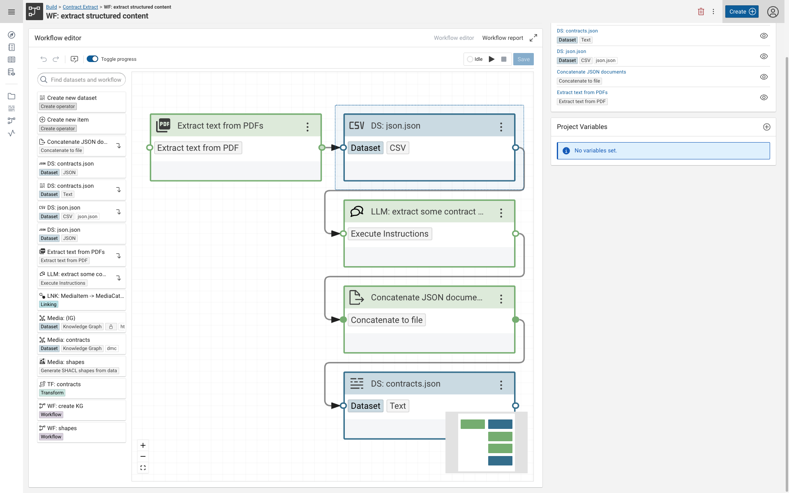
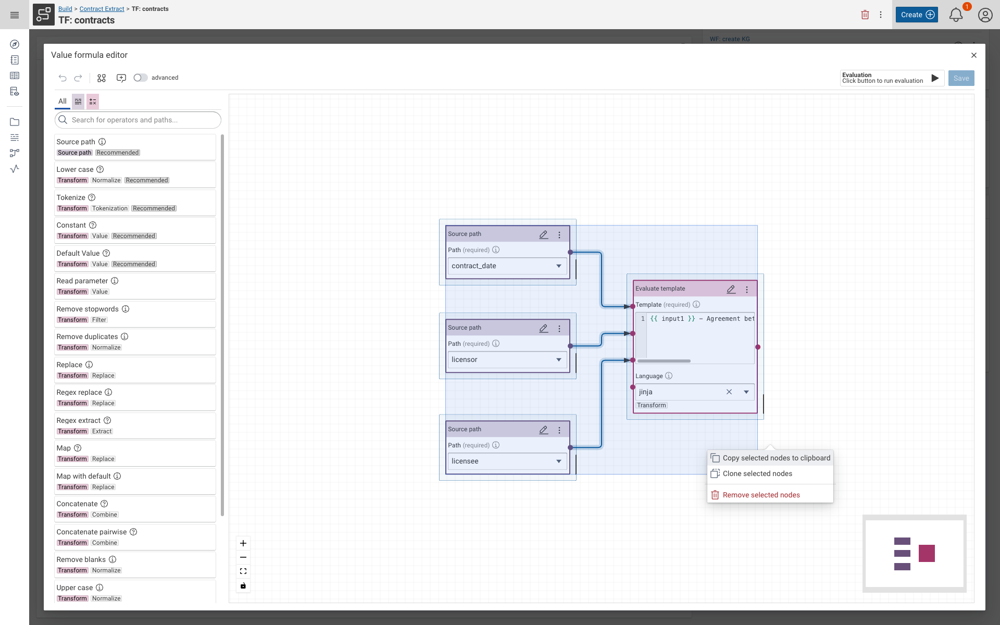
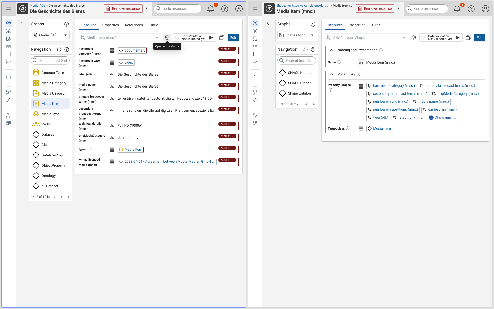

# Corporate Memory 25.1.2

Corporate Memory 25.1 is the first major release in 2025.

{ class="bordered" }
{ class="bordered" }
{ class="bordered" }

The highlights of this release are:

-   Build: **Seamless Workflow Integration**
    -   Directly connecting datasets with explicit schemas to workflow operators simplifies data ingestion and processing, allowing users to quickly incorporate CSV and text data into their workflows.

-   Build: **Improved Rule Editing Experience**
    -   Enhanced copy & paste functionality in rule editors boosts productivity by making it easier to manage and edit rules accurately and efficiently.

-   Explore and Autor: **Streamlined Shape Management**
    -   The introduction of new SHACL shape quick-access options empowers users to effortlessly build, validate, and troubleshoot complex shape configuration.

-   Automate: **Lightning-fast Parameterized Queries**
    -   The new `cmemc` query placeholder specifications enable super-fast execution of parameterized queries by running background value queries to provide dynamic completions, significantly enhancing data query responsiveness.

!!! info inline end "Important info"

    Since v24.3.0, the components eccenca DataPlatform and eccenca DataManager are merged into a single component eccenca Explore.

This release delivers the following component versions:

-   eccenca DataIntegration v25.1.1
-   eccenca Explore v25.1.2 (formerly DataPlatform and DataManager)
-   eccenca Corporate Memory Control (cmemc) v25.1.1

We tested this release with the following dependency components:

-   Ontotext GraphDB v10.8.3
-   Keycloak v25.0.6

More detailed information for this release is provided in the next sections.

## eccenca DataIntegration v25.1.1

We're excited to bring you the latest update to DataIntegration v25.1, which introduces new features, improvements and bug fixes:

**v25.1.1 of DataIntegration ships the following fixes and additions:**

- OIDC
    -   added support for Request Party-Initiated Logout as specified by OpenID Connect
- S3
    -   Now defaults to the AWS credentials provider chain if S3 access and secret keys are not configured.
- Python
    -   Prevented redundant re-imports of already loaded modules.
    -   Updated `FileEntitySchema` in `cmem-plugin-base` for improved compatibility with datasets.
- RegexExtractionTransformer
    -   Resolved an issue that incorrectly generated null values.

**v25.1.0 of DataIntegration adds the following new features:**

-   Use colors for workbench tags.
-   Added a new operator for concatenating input values into a file.
-   Enabled copy & paste functionality in rule editors.
-   Datasets with explicit schemas can now be directly connected to workflow operators.
    -   Supported for CSV and text datasets.
    -   If a supported dataset is connected to a workflow operator with a flexible input schema, the entire dataset (i.e., all properties of its primary type) is read.
    -   For CSV datasets, this results in entities being read with all columns included.
-   Allow changing the width of blocks in the mapping editor.

**v25.1.0 of DataIntegration introduces the following changes:**

-   Invisible parameters are now part of the config port schema.
-   Improved file names for downloaded projects and workspaces.
-   SPARQL results are streamed as JSON instead of XML.
-   The root breadcrumb and the _Build_ logo in the navigation sidebar now direct to the _projects_ search facet instead of _All types_.

**v25.1.0 of DataIntegration ships the following fixes:**

-   Fixed URI rule evaluation failure for empty object mappings.
-   No duplicate JDBC jar configuration is required anymore.
-   Fixed issue with JSON datasets not always navigating into arrays.
-   Fixed issue where direct transform execution does not use project variables.
-   Fixed Transform Evaluation failure when a rule contains a template transformer.
-   Fixed issue where URI pattern input sometimes resets to its initial value or crashes the mapping editor.
-   Fixed issue where SPARQL restriction expands the wrong SPARQL pattern when using property paths with prefixed names.
-   Fixed RDF file upload issue.
-   Fixed issue where the reference entities cache fails to load a large number of entities from the RDF store.
-   Fixed issue where tasks created in the workflow editor are not added to the recently viewed list.
-   Fixed issue where adding a note to a linking rule fails to save.

## eccenca Explore v25.1.2

!!! info inline end "Important info"

    Since v24.3.0, the components eccenca DataPlatform and eccenca DataManager are merged
    into a single component eccenca Explore.

We are excited to announce Explore v25.1, which introduces new features, improvements and bug fixes.

**v25.1.2 of Explore ships the following fixes:**

-   Spring Boot Gradle plugin patch upgrade to address CVE-2025-31651
-   Consider owl import resolution in QUERY CBD resolution strategy
-   Link Rules - Rule Setup: parameters of paths retain values, changes on save are shown, even if requests in the background still run.
-   Fix ACL Management rights for writing access conditions

**v25.1.1 of Explore ships the following fixes:**

-   OIDC
    -   Add deployment property for post logout redirect uri
-   Shacl
    -   Disable adding properties if the max amount of properties is reached
    -   Show fields of subshapes
-   BKE
    -   Prevent loading candidates queries for readonly properties
    -   Switching between nodeshapes

**v25.1.0 of Explore adds the following new features:**

-   Other
    -   Added support for Virtuoso 8.3:
        -   Uses the eccenca Docker image for GitLab CI tests.
        -   Includes adjustments in the store connection to address specific Virtuoso issues.
-   SHACL
    -   Added a download option for value queries in the complex view.
    -   Values in the table view are now sorted by IRI by default; this can be overridden by setting `shui:disableDefaultValueSorting true`.
    -   Added a new SHACL form to the graph creation interface.
    -   Added a debug node shape option for quick access.
    -   Corrected the display of lists of `xsd:anyURI` literals with long URIs.
-   BKE
    -   Improved whitespace formatting in the BKE dossier.

**v25.1.0 of Explore ships the following changes:**

-   SHACL
    -   Conditionally hid the remove, create, and clone buttons.
    -   Added support for GraphDB 10.8.3.
    -   Removed quad upload support for GSP and the upload endpoint
    (GSP quads are not supported by stores or are uploaded as triples to a single graph only).
-   Link Rules
    -   Adjusted link rules to use the new ACL API.
-   SHACL
    -   Stabilized the UI during loading.
    -   Updated graph creation forms to the current SHACL system.
-   BKE
    -   Merged the display of relations when property shape mode is deactivated.
    -   Saved graph changes while preserving the visualization state.
-   Query Module
    -   Catalogue queries are now deleted using resource deletion (CBD).
-   Other
    -   Switched the backend build system to use _Maven Central_ instead of _Artifactory_, which also removes the blocking Virtuoso dependency.
    -   Added `POST` endpoints for `GET` data requests that may result in long IRIs.
    -   Updated to Spring Boot 3.4.
    -   Made Apache Jena SPARQL query result streaming adjustable via the `proxy.proxy-sparql-streaming-format` configuration (default: `XML`; possible values: `JSON`, `XML`).
    -   Updated Apache Jena to version 5.3.0.
    -   Implemented a new serialization method for paged responses (currently relevant only for access condition management endpoints/clients).

**v25.1.0 of Explore ships the following fixes:**

-   Other
    -   Render node shapes without property shapes correctly—that is, display their widgets.
    -   The root admin username now resolves to the actual account name rather than a fixed `admin`.
    -   GSP file uploads via multipart requests now allow file suffixes in uppercase.
    -   Re-enabled Prometheus cache metrics.
    -   URIs with escaped characters are now preserved.
    -   Added an indication for broken workspace configurations in the UI.
    -   Fixed missing translations in messages prompting necessary re-login.
-   SHACL
    -   Resolved the `shuiObject` placeholder correctly in custom queries when a resource is created.
    -   In Shacline, subshapes now have a cutoff of 20; a warning is displayed when the limit is reached.
    -   Fixed an issue where adding a new subshape caused unwanted duplication of existing subshapes of the same type.
    -   Subshapes are now removed if their removal is revoked.
-   BusinessKnowledgeEditor (BKE)
    -   Added support for value queries in BKE.

## eccenca Corporate Memory Control (cmemc) v25.1.1

We're excited to bring you the latest update to Corporate Memory Control (cmemc) v25.1, which introduces new features, improvements and bug fixes.

**v25.1.1 of cmemc introduces the following changes:**

-   corrected target versions
-   corrected migration target versions

**v25.1.0 of cmemc adds the following new features and change behaviour:**

-   `query execute` command
    -   shell completion of placeholder values (using annotated QueryPlaceholder resources)
-   `admin workspace python reload` command
    -   reload / register all installed plugins into the DataIntegration workspace
-   `admin workspace python list-plugins` command
    -   will warn now if plugins are installed but not registered
-   `admin migration` command group
    -   `hide-header-footer-25.1` migration recipe
    -   Remove triples using deprecated shui:valueQueryHideHeader|Footer terms
-   `query execute` command
    -   in case the user does not request a specific content type, some results are shown as a table (instead of `text/csv`)
    -   `--accept` option now has completion support
-   base command
    -   `--external-http-timeout` option to specify the timeout for non-CMEM HTTP requests
-   configuration via INI config file
    -   allow debug and proxy settings for a connection
    -   allow settings in the `DEFAULT` section of the config file for all connections
-   change in configuration loading order, to integrate the values from the `DEFAULT` section:
    1.   load environment variables into options-dict (click is doing this for `CMEMC_` variables)
    2.   load options from command line and overwrite environment (only `CMEMC_` variables)
    3.   load `DEFAULT` value keys, but not for keys which are already set (i.e not override cli options or env variables)
    4.   load named INI section values (in case there is an INI section given) -> this will not overwrite everything
    5.   use API defaults if there are not enough config keys (use default `CMEM_BASE_URI`, default `OAUTH_GRANT_TYPE` and default `OAUTH_CLIENT_ID`|`SECRET` if not present)

**In addition the following changes and fixes are included:**

-   `admin workspace python uninstall` command
    -   shell completion uses correct connection now

## Migration Notes

!!! info

    We do not guarantee forward compatibility for configuration, data or projects.
    I.e. importing a project created with DataIntegration v25.1.0 into DataIntegration v24.3.0 (or older) might not work.

    Backward compatibility will be ensured or migration paths explained.
    I.e. projects created with DataIntegration v24.3.0 can be imported into DataIntegration v25.1.0.

!!! info "Important info"

    Since v24.3.0, the components eccenca DataPlatform and eccenca DataManager are merged
    into a single component eccenca Explore.

### eccenca Corporate Memory Control (cmemc)

-   `query execute` command
    -   use `--accept` in case you need explicit CSV output
