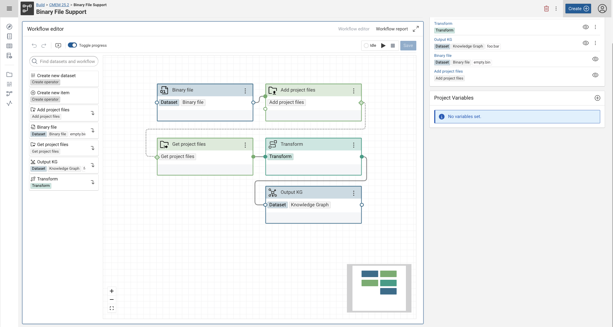
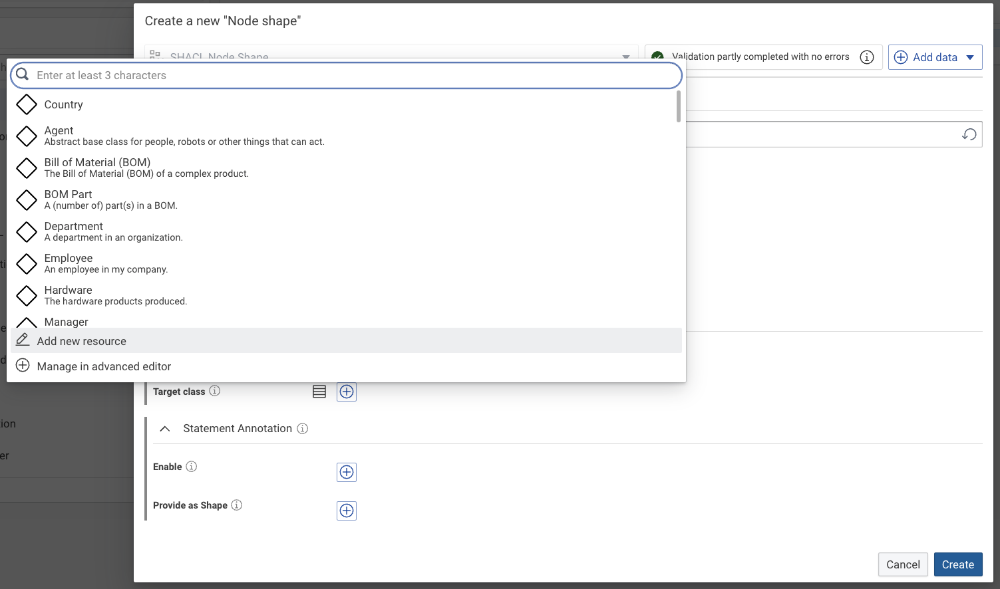
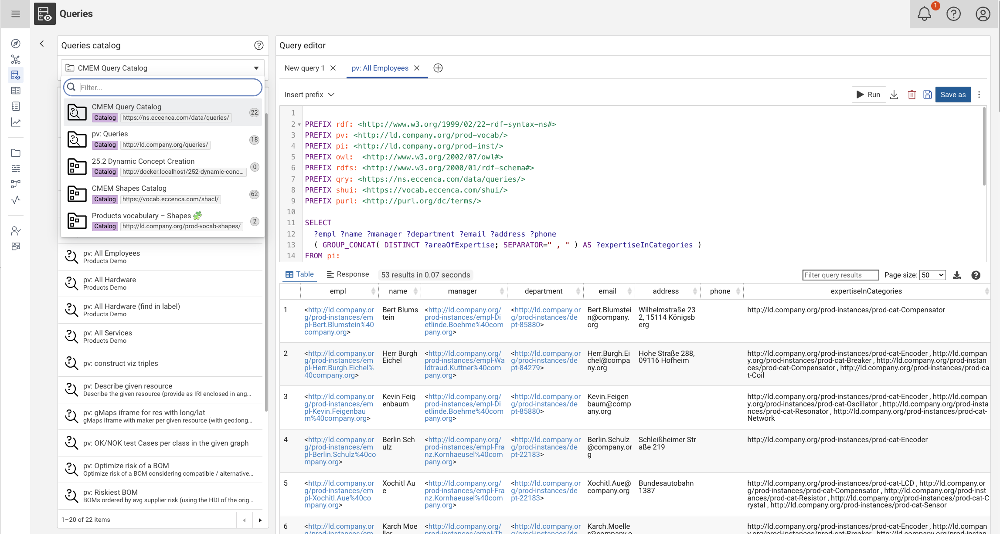

# Corporate Memory 25.2.2

Corporate Memory 25.2 is the second major release in 2025.

{ class="bordered" }
{ class="bordered" }
{ class="bordered" }
<!--
-->

The highlights of this release are:

-   Build: **Enhanced File Management in Workflows**
    -   New binary file dataset and project file operators enable seamless integration of PDFs, images, and other binary files directly into workflows, streamlining document processing pipelines.

-   Explore: **Dynamic Class and Property Creation**
    -   Create classes and properties on-the-fly while defining SHACL shapes, dramatically accelerating ontology development and data modeling workflows without context switching.

-   Explore and Automate: **Multi-Graph Query Management**
    -   The enhanced query catalog now supports multiple query graphs and arbitrary graph selection, enabling better organization and management of SPARQL queries across different knowledge domains.

-   Build: **Mapping Creator** (BETA)
    -   New visual mapping management and GenAI based mapping environment, allowing unparalleled clarity, speed and ease in building and maintaining your mapping rules.

!!! info inline end "Important info"

    Since v24.3.0, the components eccenca DataPlatform and eccenca DataManager are merged into a single component eccenca Explore.

This release delivers the following component versions:

-   eccenca DataIntegration v25.2.1
-   eccenca Explore v25.2.2
-   eccenca Corporate Memory Control (cmemc) v25.4.0

We tested this release with the following dependency components:

-   Ontotext GraphDB v11.0.2
-   Keycloak v25.0.6

More detailed information for this release is provided in the next sections.

## eccenca DataIntegration v25.2.1

We are excited to announce the release of DataIntegration v25.2.1, which introduces powerful new file handling capabilities, enhanced workflow features, and important infrastructure updates.

**v25.2.1 of DataIntegration ships the following fixes and additions:**

-   Icon button tooltips do not pop up out of control
-   Edge markers are displayed in workflow editor
-   If a project is imported to the knowledge graph backend, the graph is deleted before import

**v25.2.0 of DataIntegration adds the following new features:**

-   New operators and dataset for improved file handling in workflows:
    -   **Add project files** workflow operator - Add files to projects directly from workflows
    -   **Get project files** workflow operator - Retrieve and process project files within workflow executions
    -   **Binary file dataset** - Handle binary files (PDF, images, etc.) in data integration pipelines
-   **Neo4j database configuration** - Added parameter to configure specific databases in Neo4j connections
-   **Project variable autocompletion** - All template operators now support autocompletion for project variables
-   **Camel case transform operator** - Convert text to camel case format for data standardization
-   **Project page URL suffix configuration** - New config key `workbench.project.defaultUrlSuffix` to configure the project page view (defaults to `?itemType=workflow&page=1&limit=10`)
-   **Path auto-completion** - Mapping and linking rule editors now feature intelligent path auto-completion like in value mapping forms

**v25.2.0 of DataIntegration introduces the following changes:**

-   **Infrastructure updates:**
    -   Migrated to Java 21 for improved performance and latest language features
    -   Updated Docker base image to `eclipse-temurin:21-ubi9-minimal`
-   **"Internal dataset (single graph)"** added to plugins to properly display reports using this dataset type
-   **Configurable favicon** - Organizations can customize the application favicon
-   **JSON dataset improvements:**
    -   New parameter to control automatic navigation into JSON arrays
    -   New `#arrayPath` path operator for explicit navigation into JSON arrays (available when automatic JSON array navigation is set to `false`)
    -   New `#uuid` path operator generates type 3 (name-based) UUIDs from JSON node string representations
    -   New `#arrayText` path operator for enhanced array value extraction

**v25.2.0 of DataIntegration ships the following fixes:**

-   Fixed queries with ORDER BY clauses in SQL dataset
-   Fixed create task dialog focus issues when opened via 'connect to newly created...' menu option
-   Fixed errors in Office 365 dataset tests and adapted to Microsoft API changes
-   Fixed display issues for workflow reports containing internal datasets
-   Fixed drag-and-drop problems when adding operators to nested workflow editors
-   Non-printable characters in CSV datasets are now preserved during read/write transformations
-   XML datasets now return empty values for empty tags when string values are expected
-   Project variable updates now properly use the triggering user's credentials

## eccenca Explore v25.2.2

We are pleased to announce Explore v25.2.2, which brings significant enhancements to SHACL shape management, improved graph handling, and a modernized knowledge graph exploration experience.

**v25.2.2 of Explore ships the following fixes and additions:**

-   Update the gui-elements version to solve the edges cut problem

**v25.2.1 of Explore ships the following fixes and additions:**

-   Pagination for inline views of Dataset (used for preview in cmem build)
-   Widgets for shaped resources without properties to display are shown
-   Update/Replace in the explore graph list

**v25.2.0 of Explore adds the following new features:**

-   **Enhanced SHACL Shape Management:**
    -   Create target classes for node shapes on-the-fly during shape definition
    -   Create properties for property shapes on-the-fly without leaving the shape editor
    -   Create classes for property shapes on-the-fly for better data modeling
    -   Support for defining properties with `domainIncludes` and `rangeIncludes` predicates (as defined in either `schema:`,`dcam:` or `gist:`)
-   **Query Catalog Enhancements:**
    -   Graph selection support for Query Catalog, allowing multiple query catalog graphs and editing queries in arbitrary graphs
    -   Graph selection support for Charts visualization, allowing to store and edit chart visualization in arbitrary graphs
-   **GraphDB 11.0.x Support** - Full compatibility with the latest GraphDB version
-   **Unified Error Handling** - New RTKAction handler provides consistent error handling across the application

**v25.2.0 of Explore introduces the following changes:**

-   **Infrastructure Updates:**
    -   Upgraded to Spring Boot 3.5.x and Apache Jena 5.4
    -   Migrated to Java 21 runtime for improved performance
-   **Timetracker Module** - Complete rework of the Timetracker and reports module for better performance and usability
-   **Knowledge Graph Editor (BKE) Improvements:**
    -   Updated to React Flow v12 for enhanced graph visualization
    -   Automatic canvas scrolling when dragging items beyond visible area
    -   Advanced multi-select functionality on canvas for bulk operations
-   **SPARQL Query Endpoints** - Changed to use an explicit list of allowed content types for better security
-   **Catalog Query Management** - Update and SELECT queries are now differentiated by `rdf:type` using `shui:SparqlQuery` or `shui:UpdateQuery`

**v25.2.0 of Explore ships the following fixes:**

-   **Query Catalog:**
    -   Fixed SPARQL Query editor behavior after "save as" operation
    -   Improved error handling in Query Catalog API
-   **Knowledge Graph Editor (BKE):**
    -   Property shape descriptions now consistently display as tooltips
    -   Fixed selection issues with expanded nodes
    -   Fixed greyed-out entries in Initial Search & Explore Navigation Box
    -   Resolved highlight lag issues for better performance
-   **General Fixes:**
    -   Added warning when "New graph from File" overwrites existing graphs
    -   Empty node shapes are now properly hidden
    -   Fixed SHACL Edit Validation Button stability issues
    -   Fixed SHACL MaxCount property behavior
    -   Resolved duplicate entries in ResourceManager table
    -   Fixed broken resource selection for domain and range when graphs contain complex classes
    -   Enabled empty GSP multipart file uploads

## eccenca Corporate Memory Control (cmemc) v25.4.0

!!! info inline end "Important info"

    This eccenca Corporate Memory release is the first release where we introduced Semantic Versioning for our components.
    This cmemc release notes section reflects this by reporting multiple minor versions in one section.

We are excited to announce cmemc v25.4.0, which introduces new features, improvements and bug fixes.

**v25.4.0 of cmemc adds the following new features:**

-   `query` command group
    -   can be used with arbitrary query graphs now
    -   `query list` command - new `--catalog-graph` option to select query catalog
    -   `query execute` command - new `--catalog-graph` option to select query catalog
    -   `query open` command - new `--catalog-graph` option to select query catalog

**v25.3.0 of cmemc adds the following new features:**

-   `dataset create` command
    -   support for binary file datasets
        -   suggest pdf, png, jpg, jpeg, gif and tiff files as binary file dataset
        -   shell completion of these files
-   `workflow io` command
    -   support for binary file datasets
        -   accept `application/octet-stream` as mime type for input and output files
        -   shell completion of pdf, png, jpg, jpeg, gif and tiff files as input and output
    -   add support for markdown documents as text datasets

**v25.2.0 of cmemc adds the following new features:**

-   `graph imports` command group
    -   `graph imports create` command - Add graph import to a graph
    -   `graph imports delete` command - Delete graph import from a graph
    -   `graph imports list` command - List accessible graph's imports
-   `graph export` command
    -   `--include-import-statements` option to save a `*.imports` file preserving imports of a graph
-   `graph import` command
    -   `--include-import-statements` option to read the `*.imports` files and add the preserved imports to the store
-   `graph delete` command
    -   `--include-import-statements` option to delete imports from other graphs to the deleted graph

## Migration Notes

!!! info "Backward and Forward Compatibility"

    We do not guarantee forward compatibility for configuration, data or projects.
    I.e. importing a project created with DataIntegration v25.2.0 into DataIntegration v25.1.0 (or older) might not work.

    Backward compatibility will be ensured or migration paths explained.
    I.e. projects created with DataIntegration v24.3.0 can be imported into DataIntegration v25.1.0.

!!! info "Important info"

    Since v24.3.0, the components eccenca DataPlatform and eccenca DataManager are merged
    into a single component eccenca Explore.

### eccenca DataIntegration

-   The following plugins have been deprecated and will be removed in a future release:
    -   Old Python plugins depending on Jython (Python 2.x)
    -   Spark scripting plugins
    -   Spark virtual dataset
    -   Legacy REST operator
-   To check if your instance uses any deprecated plugins, use the endpoint: `GET {DataIntegrationURL}/api/core/usages/deprecatedPlugins`

### eccenca Explore

-   **Query Catalog Query Type Changes** - Catalog managed queries no longer persist `shui:queryType`. Update and SELECT queries are now differentiated by `rdf:type`:
    -   SELECT queries use `shui:SparqlQuery`
    -   UPDATE queries use `shui:UpdateQuery`

### eccenca Corporate Memory Control (cmemc)

-   With the introduction of the `graph imports` command group, the `graph tree` command is now deprecated.
    -   use `graph imports tree` instead
