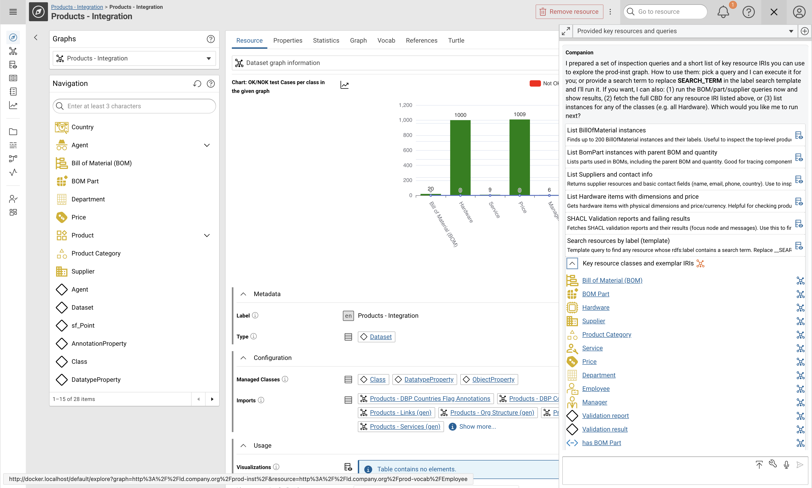

# Corporate Memory 25.3.2

Corporate Memory 25.3 is the third major release in 2025.

{ class="bordered" }

{ class="bordered" }

{ class="bordered" }

The highlights of this release are:

- Build: **Mapping Creator**
    - Experience a **next-generation, GenAI-driven visual mapping tool** that redefines how you build and manage mapping rules—with unparalleled clarity, speed, and simplicity.

- Explore: **Companion Chat-Based Data Interaction**
    - Introducing an **LLM-powered conversational interface** that lets you interact directly with your data.

    Ask questions about your graphs, explore insights using query catalogs or autogenerated queries, and access Corporate Memory resources and modules—all within chat.

    This feature takes data accessibility and interaction to an entirely new level.

- Explore: **Graph Insights**
    - Visually explore your graphs contents and relationships in an **aggregated representation** that scales easily to graphs with millions of nodes.

    Offering a **compact and flexible overview** aggregating objects and relations and shows details on demand.

<!--
-   Explore and Automate: **ADD YOURS**
    -   …
-->

This release delivers the following component versions:

- eccenca DataIntegration v25.3.3
- eccenca Explore v25.3.3
- eccenca Corporate Memory Control (cmemc) v25.6.0
- eccenca Graph Insights v19.1.1-2

We tested this release with the following dependency components:

- Ontotext GraphDB v11.1.2
- Keycloak v26.4.5

More detailed information for this release is provided in the next sections.

## eccenca DataIntegration v25.3.3

We are excited to announce the release of DataIntegration v25.3, bringing the new LLM powered Mapping Creator experience, explicit Databricks connectivity, richer dataset and plugin APIs, streamlined Python plugin tooling, and broad workflow and editor reliability improvements.

**v25.3.3 of DataIntegration ships the following fixes:**

- JSON dataset: #arrayText on non-existing properties now returns empty result instead of empty array string.

**v25.3.2 of DataIntegration ships the following fixes:**

- Upgrade of docker base image in order to fix vulnerabilities.
- Plugin parameter description allows Markdown rendering in shortened preview.

**v25.3.1 of DataIntegration ships the following fixes:**

- Display HTML entities correct in task parameter dialog.

**v25.3.0 of DataIntegration adds the following new features:**

- **Data sources and workflow operators:**
    - Added explicit Databricks support.
    - Added an operator that allows arbitrary SQL statements as input for `SqlDataset`.
    - Added an endpoint for browsing files to simplify file selection.
    - Added a documentation link to the comparison task node to surface guidance in-context.
    - Added the `**` operator to the JSON dataset so all child nodes can be selected recursively.
- **Text preparation:**
    - Introduced a new default stop word remover and improved the existing stop word transformers.
- **Plugin APIs:**
    - Added the `pluginType` attribute to the `/core/plugins` endpoint response.
    - Added a `/pluginTypes` endpoint to list all plugin types.
    - Added the `backendType` attribute to plugin JSON payloads to highlight whether a plugin is native or Python-based.
- **Python plugin development:**
    - Added `autocomplete_query` to `ParameterType`, providing a more flexible alternative to the legacy `autocomplete` function.

**v25.3.0 of DataIntegration introduces the following changes:**

- **Data connectors and storage workflows:**
    - Adapted the Google Drive Spreadsheet dataset tests to accommodate Google’s changed behavior.
    - Projects imported into a knowledge graph backend now delete the target graph before import to avoid stale data.
- **Mapping Creator experience:**
    - New quick tour that introduces the important elements of the Mapping Creator.
    - Mapping rules opened from the Mapping Creator no longer need to be saved immediately.
    - Newly created mapping rules that are not yet persisted can now be edited directly in the Mapping Creator.
- **UI and documentation improvements:**
    - Improved the formatting of operator examples for better readability.
    - Updated the application to the new color palette.
    - Made decoding underscores to spaces an explicit option in the **Strip URI prefix** transformer.
    - Improved mapping suggestions and shown justifications.
    - Support of GPT-5.
    - Many small improvements in the Mapping Creator.
    - The search lists now persist some user settings, such as the page size and sorting order.
- **Python subsystem and plugin lifecycle:**
    - Loading a Python plugin that reuses an existing identifier now records an error in the discovery result.
    - The `/listPlugins` and `/updatePlugins` endpoints now return HTTP 500 if at least one plugin fails to load (previously HTTP 200).
    - Upgraded the embedded Python subsystem:
        - Installation now relies on uv 0.9.2.
        - Updated the packaged Python distribution to Python 3.13.8.
        - Replaced the Red Hat UBI system Python with a uv-installed runtime.
        - Uses a read-only virtual environment from `/usr/local/venv`.
        - Plugin package installation now uses uv instead of pip.

**v25.3.0 of DataIntegration ships the following fixes:**

- **Workflow editor and execution:**
    - Edge arrows are displayed again in the workflow editor via React Flow v12.
    - Nested workflows no longer expose data input ports.
    - Workflow nodes loaded from the store retain their original positions.
    - Multiple operators created via “Connect to newly created operator” no longer overlap.
    - Fixed the display of workflow reports inside the modal dialog.
    - The workflow report now correctly marks failed workflows with a red danger icon and shows “Execution failed” on failed operators.
    - Transform execution reports no longer show successful executions for rules that were not run.
    - Fixed graph uploads for large files or chunk sizes.
    - Exporting a workspace without project resources now succeeds.
    - Downloading a project/workspace with empty files stored in AWS S3 works again.
    - Fixed the display of workflow reports in Plugin Custom Action Reports so the code area stays within bounds.
- **Mapping and rule authoring:**
    - Restrictions no longer expand the wrong SPARQL pattern.
    - URI rules are no longer created automatically when the default rule is opened in the rule editor.
    - Mapping Creator undo/redo actions behave as expected.
    - Suggest mappings now adds all selected rows, not just the ones currently visible after a text filter.
    - Rule editor nodes are no longer copied when text is selected in Firefox.
    - URI pattern no longer changes from nothing ("automatic default pattern") to "{}/root" after opening the value formula editor.
- **Python plugins and orchestration:**
    - Listing Python plugins no longer fails when the orchestration feature `enable-extension EXTENSION=plugins` is used.
- **Transformations, datasets, and templates:**
    - JSON `#arrayText` now returns an empty array representation for empty arrays.
    - Jinja templates no longer error when the `loop` variable is used inside functions within `for` loops.
    - Previewing parameter descriptions no longer renders broken Markdown.
    - Use `FROM` instead of `GRAPH` in the vocabulary loader to respect graph imports.
- **Graph and project handling:**
    - When importing into a knowledge graph backend, the graph is only deleted if it exists.
    - Downloading project/workspace with empty files stored in AWS S3 work now.
- **User interaction fixes:**
    - Global and workflow-specific hotkeys no longer trigger when another modal is open.
    - Display the template toggle consistently in the artefact creation dialog.
    - Global and page specific keyboard shortcuts should be ignored when a dialog is open.
    - "Description" displays content  no longer differently than entered.
    - Graph URI Drop Down does close now.
    - Close icon button to remove target entity type in transform operator now works if opened in modal.

## eccenca Explore v25.3.3

We are pleased to announce Explore v25.3, which delivers the new **Companion** LLM data interaction, a whole new way to explore your data relationships in **Graph Insights**, experimental Tentris support, major BKE authoring enhancements and a wide range of usability and stability fixes.

**v25.3.3 of Explore ships the following fixes:**

- Upgrades jinjava for mitigation of CVE-2026-25526
- Reduces docker package footprint

**v25.3.2 of Explore ships the following fixes:**

- Knowledge Graphs: Editing data in the properties tab now handles white space in literals correctly, while still cleaning IRIs.
- Knowledge Graphs & BKE: Saving a resource now reports progress with more details. The progress dialog dialog is shown after 5 seconds of waiting.

**v25.3.1 of Explore ships the following fixes:**

- The properties tab of a resource details view in the explore knowledge shows the plus button to add a new property.
- Fixed updating of count query for Resource table2.
- Shacl Query validation does not impose existence check on graph variable, display unresolved terms as sub shape content.
- Recursion fix - load only limited depth of sub shapes, prevent displaying cycled sub shapes.

**v25.3.0 of Explore adds the following new features:**

- **Graph Insights**
    - New visual graph exploration and visual query UI for easy relation analysis.
- **Companion:**
    - LLM based integrated chat to interact with your data, generate or user SPARQL queries, providing a deep integration with Corporate Memory features
    - MCP Server SSE endpoint to provide the tool powering _Compaion_ to external clients
- **Backend:**
    - Added experimental support for the Tentris store backend.
    - Added support for configuring a fixed authorization bearer token in the HTTP store backend.
- **BKE authoring enhancements:**
    - Execute workflows triggered by node shapes directly from BKE.
    - Simplified connecting nodes from the possible resources menu on the canvas.
    - Added the missing tooltips for multiple BKE buttons.
- **SHACL authoring usability:**
    - Added a tooltip to the LiteralContainer component.

**v25.3.0 of Explore introduces the following changes:**

- **Thesaurus navigation:**
    - Navigation tree items are now sorted by their labels for consistent browsing.

**v25.3.0 of Explore ships the following fixes:**

- **General platform fixes:**
    - Handle external and internal redirects to preserve unsaved work.
    - Restored the LinkRules download button.
    - The SPARQL GSP DELETE request now returns 404 for non-existing graphs consistently across backends.
    - Explore now relies on GraphDB to manage stopwords, ensuring correct filtering.
    - Fixed an empty state regression when the graph list query returns no results.
    - Failures in the shape catalog no longer block other tabs.
    - Prevented blank pages in the query editor when previous queries were not saved.
    - SHACL now handles custom value queries without bindings more gracefully.
- **BKE stability improvements:**
    - Improved error handling for validation requests in the BKE module.
    - Fixed the BKE visualization saving issue.
    - UI query requests for connectable candidates now only run for resources.
    - The "Open resource details" link can again be opened in a new browser tab.
- **SHACL editing reliability:**
    - Added a loading state for SHACL edit controls to provide clearer feedback.

**v25.3.0 of Explore removes the following functionality:**

- Removed the deprecated LLM assistance feature.

## eccenca Corporate Memory Control (cmemc) v25.6.0

We are excited to announce cmemc v25.6.0, which introduces new features, improvements and bug fixes.

**v25.6.0 of cmemc adds the following new features:**

- `project file` command group
    - `list` command - List available file resources
    - `delete` command - Delete file resources
    - `inspect` command - Display all metadata of a file resource
    - `usage` command - Display all usage data of a file resource
    - `upload` command - Upload a file to a project file resource
    - `download` command - Download file resources to the local file system

**v25.6.0 of cmemc ships the following fixes:**

- `query execute` command
    - placeholder query result without description do not crash the app anymore

**v25.6.0 of cmemc deprecates following functionality:**

- `dataset resource` command group
    - command group is now hidden
    - use the more generic `project file` command group instead

**v25.5.0 of cmemc adds the following new features:**

- `admin acl create` and `admin acl update` commands
    - new `--read-graph-pattern` option for granting read access to graphs matching a pattern
    - new `--write-graph-pattern` option for granting write access to graphs matching a pattern
    - new `--action-pattern` option for granting action permissions matching a pattern
    - patterns support wildcard (`*`) at the end or standalone wildcard for broad access
- `admin token` command
    - new `--ttl` option to output information about the lifetime of the access token.
- `graph insights` command group
    - `graph insights create` command - Create or update a graph insight snapshot
    - `graph insights delete` command - Delete a graph insight snapshot.
    - `graph insights inspect` command - Inspect the metadata of a graph insight snapshot.
    - `graph insights list` command - List graph insight snapshots.
- `vocabulary install` command
    - new `--replace` option to re-install already installed vocabularies
- `admin acl create` command
    - new `--replace` option to replace (overwrite) existing access condition.

**v25.5.0 of cmemc ships the following fixes:**

- `dataset create` command
    - `*.xls` files are tab-completed and treated as excel datasets
- `workflow io` command
    - `*.xls` files are tab-completed and treated as excel datasets
- `query open` command
    - open a file based query in browser now possible again
- `admin workspace python install` command
    - error handling corrected
- `admin workspace python reload` command
    - error handling corrected
- `graph import` command
    - gzipped files into tentris store: now sends correct content encoding header
- `dataset resource` command group
    - completion of projects with `project` filter does not crash anymore
- `project list` command
    - projects without label metadata are handled correctly now
- `project` command group
    - shell completion for projects without label metadata does not crash anymore

**v25.5.0 of cmemc introduces the following changes:**

- upgrade click to 8.3.0
- docker image: upgrade python to 3.13.8 (using uv)
- cmemc does warn now if executed with python other than 3.13

## Migration Notes

!!! info "Backward and Forward Compatibility"

    We do not guarantee forward compatibility for configuration, data or projects.
    I.e. importing a project created with DataIntegration v25.2.0 into DataIntegration v25.1.0 (or older) might not work.

    Backward compatibility will be ensured or migration paths explained.
    I.e. projects created with DataIntegration v24.3.0 can be imported into DataIntegration v25.1.0.

!!! info "Important info"

    Since v24.3.0, the components eccenca DataPlatform and eccenca DataManager are merged
    into a single component eccenca Explore.

### eccenca DataIntegration

- **Updated plugin identifiers:** To guarantee unique plugin identifiers, several configuration keys changed. The updates only affect configuration references—existing projects remain intact.
    - `workspace.provider.plugin`: `inMemory` → `inMemoryWorkspaceProvider`, `file` → `fileWorkspaceProvider`.
    - `workspace.repository.plugin`: `inMemory` → `inMemoryResourceRepository`, `file` → `sharedFileRepository`.
    - `workspace.reportManager.plugin`: `inMemory` → `inMemoryExecutionReportManager`, `file` → `fileExecutionReportManager`.
- **Python autocomplete:** Dropped support for autocomplete functions that omit the `depend_on_parameter_values` parameter. This was deprecated in 23.1; earlier versions logged warnings referencing “legacy autocomplete function”.
- **Python sub-system upgrade:** The Python runtime now uses Python 3.13 with uv-based package management.
    - If you previously set `PIP_INDEX_URL`/`PIP_EXTRA_INDEX_URL`, switch to [`UV_DEFAULT_INDEX`](https://docs.astral.sh/uv/reference/environment/#uv_default_index)/[`UV_EXTRA_INDEX_URL`](https://docs.astral.sh/uv/reference/environment/#uv_extra_index_url).
    - Custom CA bundles now reside at `/usr/local/venv/lib/python3.13/site-packages/certifi/cacert.pem`.
    - Clean up the complete `python-packages` directory before or directly after upgrading (e.g., via `cmemc admin workspace python uninstall --all`).
    - Re-install required Python packages afterwards and ensure they are Python 3.13 compatible.
        - Please note that your packages need to be python 3.13 ready.
        - All [eccenca published plugins](https://documentation.eccenca.com/latest/tags/#tag:pythonplugin) are published as a new python 3.13 ready minor version.
    - If you maintain custom plugins using the [cmem-plugin-template](https://github.com/eccenca/cmem-plugin-template), update the template via copier as [described in the repository documentation](https://github.com/eccenca/cmem-plugin-template?tab=readme-ov-file#template-updates).

### eccenca Explore

- With the deprecation of the assistance feature, `assist.*` properties can be removed from your `application.yml`, they are not used any more and have been replaced by `spring.ai` configuration.
- If you are using (the deprecated) `shui:valueQuery` with any `sh:PropertyShape`, make sure you change the query signature to return the variable bindings `?resource` and `?graph`.
    The UI will display an error message if this is overlooked.
